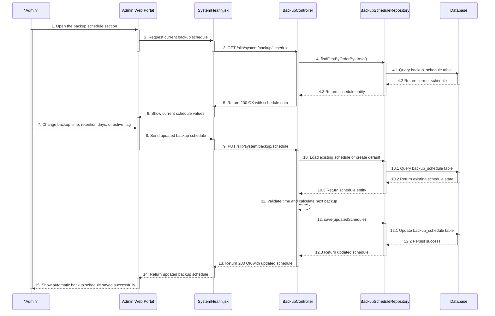

# FE-59 Set Automatic Backup Schedule

```mermaid
sequenceDiagram
    participant Users as "Admin"
    participant Client as Admin Web Portal
    participant HealthPage as SystemHealth.jsx
    participant BackupController as BackupController
    participant ScheduleRepo as BackupScheduleRepository
    participant DB as Database

    Users->>Client: 1. Open the backup schedule section
    activate Users
    activate Client
    Client->>HealthPage: 2. Request current backup schedule
    activate HealthPage
    HealthPage->>BackupController: 3. GET /slib/system/backup/schedule
    deactivate HealthPage
    deactivate Client
    activate BackupController
    BackupController->>ScheduleRepo: 4. findFirstByOrderByIdAsc()
    activate ScheduleRepo
    ScheduleRepo->>DB: 4.1 Query backup_schedule table
    activate DB
    DB-->>ScheduleRepo: 4.2 Return current schedule
    deactivate DB
    ScheduleRepo-->>BackupController: 4.3 Return schedule entity
    deactivate ScheduleRepo
    BackupController-->>HealthPage: 5. Return 200 OK with schedule data
    deactivate BackupController
    activate HealthPage
    HealthPage-->>Client: 6. Show current schedule values
    deactivate HealthPage
    activate Client
    Users->>Client: 7. Change backup time, retention days, or active flag
    Client->>HealthPage: 8. Send updated backup schedule
    activate HealthPage
    HealthPage->>BackupController: 9. PUT /slib/system/backup/schedule
    deactivate HealthPage
    deactivate Client
    activate BackupController
    BackupController->>ScheduleRepo: 10. Load existing schedule or create default
    activate ScheduleRepo
    ScheduleRepo->>DB: 10.1 Query backup_schedule table
    activate DB
    DB-->>ScheduleRepo: 10.2 Return existing schedule state
    deactivate DB
    ScheduleRepo-->>BackupController: 10.3 Return schedule entity
    deactivate ScheduleRepo
    BackupController->>BackupController: 11. Validate time and calculate next backup
    BackupController->>ScheduleRepo: 12. save(updatedSchedule)
    activate ScheduleRepo
    ScheduleRepo->>DB: 12.1 Update backup_schedule table
    activate DB
    DB-->>ScheduleRepo: 12.2 Persist success
    deactivate DB
    ScheduleRepo-->>BackupController: 12.3 Return updated schedule
    deactivate ScheduleRepo
    BackupController-->>HealthPage: 13. Return 200 OK with updated schedule
    deactivate BackupController
    activate HealthPage
    HealthPage-->>Client: 14. Return updated backup schedule
    deactivate HealthPage
    activate Client
    Client-->>Users: 15. Show automatic backup schedule saved successfully
    deactivate Client
    deactivate Users
```
