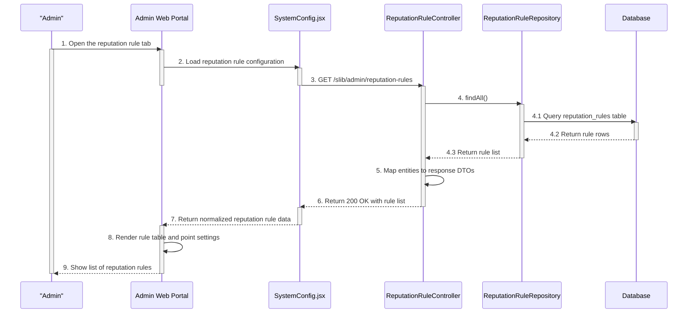

# FE-33 View List of Reputation Rules

```mermaid
sequenceDiagram
    participant Users as "Admin"
    participant Client as Admin Web Portal
    participant ConfigPage as SystemConfig.jsx
    participant RuleController as ReputationRuleController
    participant RuleRepo as ReputationRuleRepository
    participant DB as Database

    Users->>Client: 1. Open the reputation rule tab
    activate Users
    activate Client
    Client->>ConfigPage: 2. Load reputation rule configuration
    activate ConfigPage
    ConfigPage->>RuleController: 3. GET /slib/admin/reputation-rules
    deactivate ConfigPage
    deactivate Client
    activate RuleController
    RuleController->>RuleRepo: 4. findAll()
    activate RuleRepo
    RuleRepo->>DB: 4.1 Query reputation_rules table
    activate DB
    DB-->>RuleRepo: 4.2 Return rule rows
    deactivate DB
    RuleRepo-->>RuleController: 4.3 Return rule list
    deactivate RuleRepo
    RuleController->>RuleController: 5. Map entities to response DTOs
    RuleController-->>ConfigPage: 6. Return 200 OK with rule list
    deactivate RuleController
    activate ConfigPage
    ConfigPage-->>Client: 7. Return normalized reputation rule data
    deactivate ConfigPage
    activate Client
    Client->>Client: 8. Render rule table and point settings
    Client-->>Users: 9. Show list of reputation rules
    deactivate Client
    deactivate Users
```
