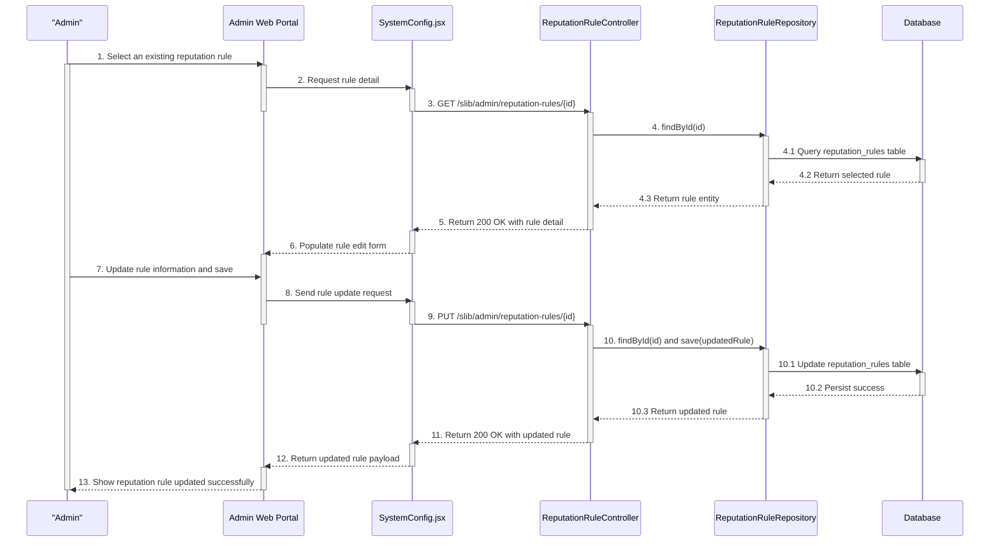

# FE-34a View and Update Reputation Rule

```mermaid
sequenceDiagram
    participant Users as "Admin"
    participant Client as Admin Web Portal
    participant ConfigPage as SystemConfig.jsx
    participant RuleController as ReputationRuleController
    participant RuleRepo as ReputationRuleRepository
    participant DB as Database

    Users->>Client: 1. Select an existing reputation rule
    activate Users
    activate Client
    Client->>ConfigPage: 2. Request rule detail
    activate ConfigPage
    ConfigPage->>RuleController: 3. GET /slib/admin/reputation-rules/{id}
    deactivate ConfigPage
    deactivate Client
    activate RuleController
    RuleController->>RuleRepo: 4. findById(id)
    activate RuleRepo
    RuleRepo->>DB: 4.1 Query reputation_rules table
    activate DB
    DB-->>RuleRepo: 4.2 Return selected rule
    deactivate DB
    RuleRepo-->>RuleController: 4.3 Return rule entity
    deactivate RuleRepo
    RuleController-->>ConfigPage: 5. Return 200 OK with rule detail
    deactivate RuleController
    activate ConfigPage
    ConfigPage-->>Client: 6. Populate rule edit form
    deactivate ConfigPage
    activate Client
    Users->>Client: 7. Update rule information and save
    Client->>ConfigPage: 8. Send rule update request
    activate ConfigPage
    ConfigPage->>RuleController: 9. PUT /slib/admin/reputation-rules/{id}
    deactivate ConfigPage
    deactivate Client
    activate RuleController
    RuleController->>RuleRepo: 10. findById(id) and save(updatedRule)
    activate RuleRepo
    RuleRepo->>DB: 10.1 Update reputation_rules table
    activate DB
    DB-->>RuleRepo: 10.2 Persist success
    deactivate DB
    RuleRepo-->>RuleController: 10.3 Return updated rule
    deactivate RuleRepo
    RuleController-->>ConfigPage: 11. Return 200 OK with updated rule
    deactivate RuleController
    activate ConfigPage
    ConfigPage-->>Client: 12. Return updated rule payload
    deactivate ConfigPage
    activate Client
    Client-->>Users: 13. Show reputation rule updated successfully
    deactivate Client
    deactivate Users
```
