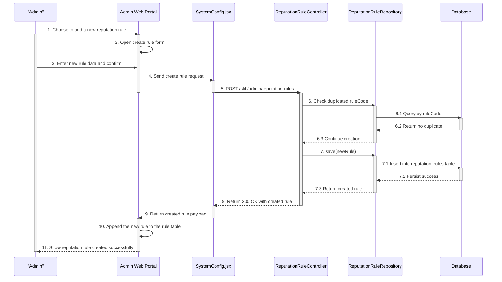

# FE-34b Create Reputation Rule

```mermaid
sequenceDiagram
    participant Users as "Admin"
    participant Client as Admin Web Portal
    participant ConfigPage as SystemConfig.jsx
    participant RuleController as ReputationRuleController
    participant RuleRepo as ReputationRuleRepository
    participant DB as Database

    Users->>Client: 1. Choose to add a new reputation rule
    activate Users
    activate Client
    Client->>Client: 2. Open create rule form
    Users->>Client: 3. Enter new rule data and confirm
    Client->>ConfigPage: 4. Send create rule request
    activate ConfigPage
    ConfigPage->>RuleController: 5. POST /slib/admin/reputation-rules
    deactivate ConfigPage
    deactivate Client
    activate RuleController
    RuleController->>RuleRepo: 6. Check duplicated ruleCode
    activate RuleRepo
    RuleRepo->>DB: 6.1 Query by ruleCode
    activate DB
    DB-->>RuleRepo: 6.2 Return no duplicate
    deactivate DB
    RuleRepo-->>RuleController: 6.3 Continue creation
    deactivate RuleRepo
    RuleController->>RuleRepo: 7. save(newRule)
    activate RuleRepo
    RuleRepo->>DB: 7.1 Insert into reputation_rules table
    activate DB
    DB-->>RuleRepo: 7.2 Persist success
    deactivate DB
    RuleRepo-->>RuleController: 7.3 Return created rule
    deactivate RuleRepo
    RuleController-->>ConfigPage: 8. Return 200 OK with created rule
    deactivate RuleController
    activate ConfigPage
    ConfigPage-->>Client: 9. Return created rule payload
    deactivate ConfigPage
    activate Client
    Client->>Client: 10. Append the new rule to the rule table
    Client-->>Users: 11. Show reputation rule created successfully
    deactivate Client
    deactivate Users
```
