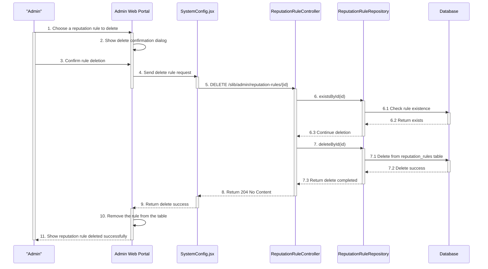

# FE-34c Delete Reputation Rule

```mermaid
sequenceDiagram
    participant Users as "Admin"
    participant Client as Admin Web Portal
    participant ConfigPage as SystemConfig.jsx
    participant RuleController as ReputationRuleController
    participant RuleRepo as ReputationRuleRepository
    participant DB as Database

    Users->>Client: 1. Choose a reputation rule to delete
    activate Users
    activate Client
    Client->>Client: 2. Show delete confirmation dialog
    Users->>Client: 3. Confirm rule deletion
    Client->>ConfigPage: 4. Send delete rule request
    activate ConfigPage
    ConfigPage->>RuleController: 5. DELETE /slib/admin/reputation-rules/{id}
    deactivate ConfigPage
    deactivate Client
    activate RuleController
    RuleController->>RuleRepo: 6. existsById(id)
    activate RuleRepo
    RuleRepo->>DB: 6.1 Check rule existence
    activate DB
    DB-->>RuleRepo: 6.2 Return exists
    deactivate DB
    RuleRepo-->>RuleController: 6.3 Continue deletion
    deactivate RuleRepo
    RuleController->>RuleRepo: 7. deleteById(id)
    activate RuleRepo
    RuleRepo->>DB: 7.1 Delete from reputation_rules table
    activate DB
    DB-->>RuleRepo: 7.2 Delete success
    deactivate DB
    RuleRepo-->>RuleController: 7.3 Return delete completed
    deactivate RuleRepo
    RuleController-->>ConfigPage: 8. Return 204 No Content
    deactivate RuleController
    activate ConfigPage
    ConfigPage-->>Client: 9. Return delete success
    deactivate ConfigPage
    activate Client
    Client->>Client: 10. Remove the rule from the table
    Client-->>Users: 11. Show reputation rule deleted successfully
    deactivate Client
    deactivate Users
```
