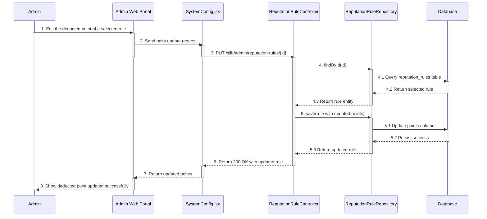

# FE-35 Set Deducted Point for Each Rule

```mermaid
sequenceDiagram
    participant Users as "Admin"
    participant Client as Admin Web Portal
    participant ConfigPage as SystemConfig.jsx
    participant RuleController as ReputationRuleController
    participant RuleRepo as ReputationRuleRepository
    participant DB as Database

    Users->>Client: 1. Edit the deducted point of a selected rule
    activate Users
    activate Client
    Client->>ConfigPage: 2. Send point update request
    activate ConfigPage
    ConfigPage->>RuleController: 3. PUT /slib/admin/reputation-rules/{id}
    deactivate ConfigPage
    deactivate Client
    activate RuleController
    RuleController->>RuleRepo: 4. findById(id)
    activate RuleRepo
    RuleRepo->>DB: 4.1 Query reputation_rules table
    activate DB
    DB-->>RuleRepo: 4.2 Return selected rule
    deactivate DB
    RuleRepo-->>RuleController: 4.3 Return rule entity
    deactivate RuleRepo
    RuleController->>RuleRepo: 5. save(rule with updated points)
    activate RuleRepo
    RuleRepo->>DB: 5.1 Update points column
    activate DB
    DB-->>RuleRepo: 5.2 Persist success
    deactivate DB
    RuleRepo-->>RuleController: 5.3 Return updated rule
    deactivate RuleRepo
    RuleController-->>ConfigPage: 6. Return 200 OK with updated rule
    deactivate RuleController
    activate ConfigPage
    ConfigPage-->>Client: 7. Return updated points
    deactivate ConfigPage
    activate Client
    Client-->>Users: 8. Show deducted point updated successfully
    deactivate Client
    deactivate Users
```
