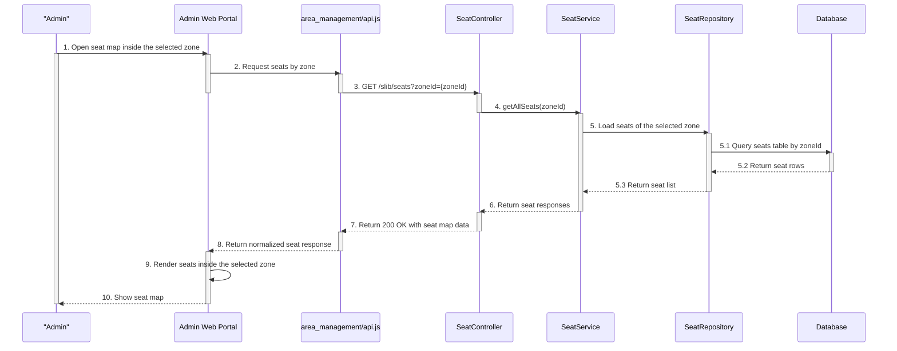

# FE-30 View Seat Map

```mermaid
sequenceDiagram
    participant Users as "Admin"
    participant Client as Admin Web Portal
    participant LayoutApi as area_management/api.js
    participant SeatController as SeatController
    participant SeatService as SeatService
    participant SeatRepo as SeatRepository
    participant DB as Database

    Users->>Client: 1. Open seat map inside the selected zone
    activate Users
    activate Client
    Client->>LayoutApi: 2. Request seats by zone
    activate LayoutApi
    LayoutApi->>SeatController: 3. GET /slib/seats?zoneId={zoneId}
    deactivate LayoutApi
    deactivate Client
    activate SeatController
    SeatController->>SeatService: 4. getAllSeats(zoneId)
    deactivate SeatController
    activate SeatService
    SeatService->>SeatRepo: 5. Load seats of the selected zone
    activate SeatRepo
    SeatRepo->>DB: 5.1 Query seats table by zoneId
    activate DB
    DB-->>SeatRepo: 5.2 Return seat rows
    deactivate DB
    SeatRepo-->>SeatService: 5.3 Return seat list
    deactivate SeatRepo
    SeatService-->>SeatController: 6. Return seat responses
    deactivate SeatService
    activate SeatController
    SeatController-->>LayoutApi: 7. Return 200 OK with seat map data
    deactivate SeatController
    activate LayoutApi
    LayoutApi-->>Client: 8. Return normalized seat response
    deactivate LayoutApi
    activate Client
    Client->>Client: 9. Render seats inside the selected zone
    Client-->>Users: 10. Show seat map
    deactivate Client
    deactivate Users
```
