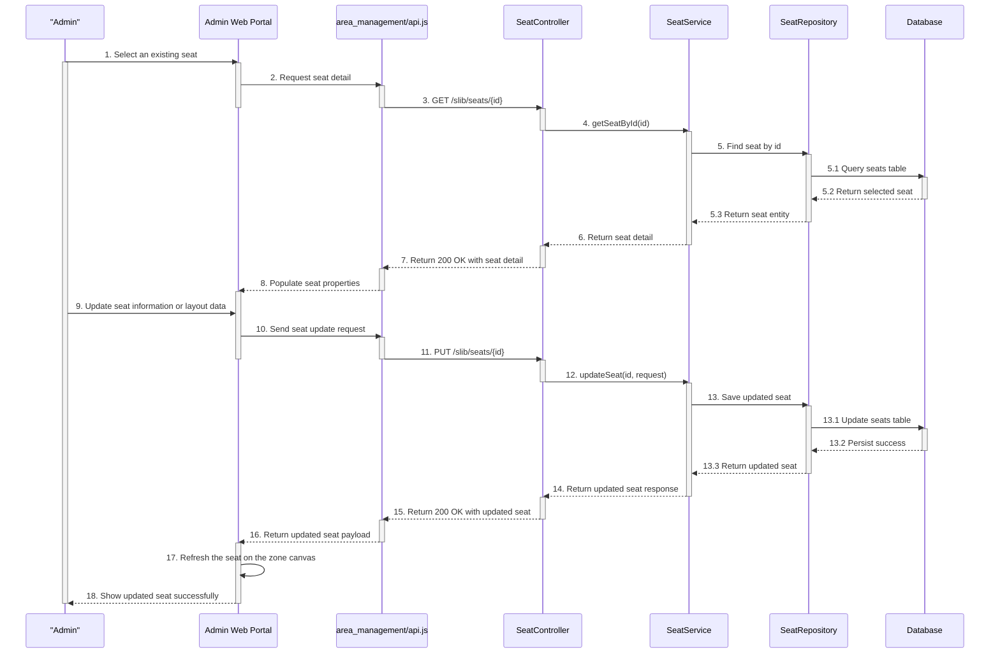

# FE-31a View and Update Seat

```mermaid
sequenceDiagram
    participant Users as "Admin"
    participant Client as Admin Web Portal
    participant LayoutApi as area_management/api.js
    participant SeatController as SeatController
    participant SeatService as SeatService
    participant SeatRepo as SeatRepository
    participant DB as Database

    Users->>Client: 1. Select an existing seat
    activate Users
    activate Client
    Client->>LayoutApi: 2. Request seat detail
    activate LayoutApi
    LayoutApi->>SeatController: 3. GET /slib/seats/{id}
    deactivate LayoutApi
    deactivate Client
    activate SeatController
    SeatController->>SeatService: 4. getSeatById(id)
    deactivate SeatController
    activate SeatService
    SeatService->>SeatRepo: 5. Find seat by id
    activate SeatRepo
    SeatRepo->>DB: 5.1 Query seats table
    activate DB
    DB-->>SeatRepo: 5.2 Return selected seat
    deactivate DB
    SeatRepo-->>SeatService: 5.3 Return seat entity
    deactivate SeatRepo
    SeatService-->>SeatController: 6. Return seat detail
    deactivate SeatService
    activate SeatController
    SeatController-->>LayoutApi: 7. Return 200 OK with seat detail
    deactivate SeatController
    activate LayoutApi
    LayoutApi-->>Client: 8. Populate seat properties
    deactivate LayoutApi
    activate Client
    Users->>Client: 9. Update seat information or layout data
    Client->>LayoutApi: 10. Send seat update request
    activate LayoutApi
    LayoutApi->>SeatController: 11. PUT /slib/seats/{id}
    deactivate LayoutApi
    deactivate Client
    activate SeatController
    SeatController->>SeatService: 12. updateSeat(id, request)
    deactivate SeatController
    activate SeatService
    SeatService->>SeatRepo: 13. Save updated seat
    activate SeatRepo
    SeatRepo->>DB: 13.1 Update seats table
    activate DB
    DB-->>SeatRepo: 13.2 Persist success
    deactivate DB
    SeatRepo-->>SeatService: 13.3 Return updated seat
    deactivate SeatRepo
    SeatService-->>SeatController: 14. Return updated seat response
    deactivate SeatService
    activate SeatController
    SeatController-->>LayoutApi: 15. Return 200 OK with updated seat
    deactivate SeatController
    activate LayoutApi
    LayoutApi-->>Client: 16. Return updated seat payload
    deactivate LayoutApi
    activate Client
    Client->>Client: 17. Refresh the seat on the zone canvas
    Client-->>Users: 18. Show updated seat successfully
    deactivate Client
    deactivate Users
```
