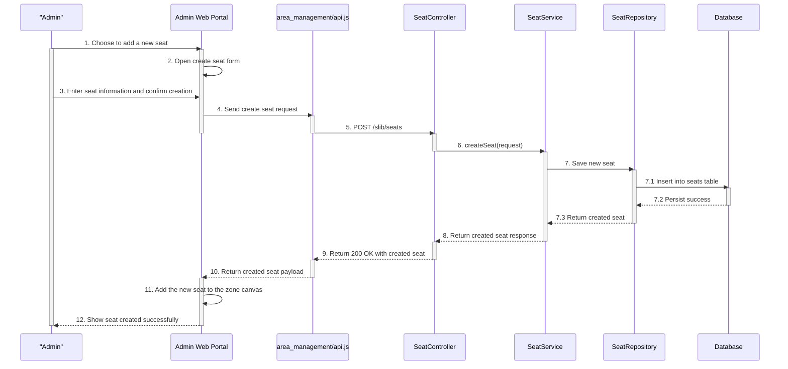

# FE-31b Create Seat

```mermaid
sequenceDiagram
    participant Users as "Admin"
    participant Client as Admin Web Portal
    participant LayoutApi as area_management/api.js
    participant SeatController as SeatController
    participant SeatService as SeatService
    participant SeatRepo as SeatRepository
    participant DB as Database

    Users->>Client: 1. Choose to add a new seat
    activate Users
    activate Client
    Client->>Client: 2. Open create seat form
    Users->>Client: 3. Enter seat information and confirm creation
    Client->>LayoutApi: 4. Send create seat request
    activate LayoutApi
    LayoutApi->>SeatController: 5. POST /slib/seats
    deactivate LayoutApi
    deactivate Client
    activate SeatController
    SeatController->>SeatService: 6. createSeat(request)
    deactivate SeatController
    activate SeatService
    SeatService->>SeatRepo: 7. Save new seat
    activate SeatRepo
    SeatRepo->>DB: 7.1 Insert into seats table
    activate DB
    DB-->>SeatRepo: 7.2 Persist success
    deactivate DB
    SeatRepo-->>SeatService: 7.3 Return created seat
    deactivate SeatRepo
    SeatService-->>SeatController: 8. Return created seat response
    deactivate SeatService
    activate SeatController
    SeatController-->>LayoutApi: 9. Return 200 OK with created seat
    deactivate SeatController
    activate LayoutApi
    LayoutApi-->>Client: 10. Return created seat payload
    deactivate LayoutApi
    activate Client
    Client->>Client: 11. Add the new seat to the zone canvas
    Client-->>Users: 12. Show seat created successfully
    deactivate Client
    deactivate Users
```
