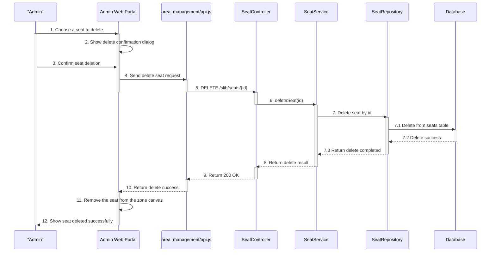

# FE-31c Delete Seat

```mermaid
sequenceDiagram
    participant Users as "Admin"
    participant Client as Admin Web Portal
    participant LayoutApi as area_management/api.js
    participant SeatController as SeatController
    participant SeatService as SeatService
    participant SeatRepo as SeatRepository
    participant DB as Database

    Users->>Client: 1. Choose a seat to delete
    activate Users
    activate Client
    Client->>Client: 2. Show delete confirmation dialog
    Users->>Client: 3. Confirm seat deletion
    Client->>LayoutApi: 4. Send delete seat request
    activate LayoutApi
    LayoutApi->>SeatController: 5. DELETE /slib/seats/{id}
    deactivate LayoutApi
    deactivate Client
    activate SeatController
    SeatController->>SeatService: 6. deleteSeat(id)
    deactivate SeatController
    activate SeatService
    SeatService->>SeatRepo: 7. Delete seat by id
    activate SeatRepo
    SeatRepo->>DB: 7.1 Delete from seats table
    activate DB
    DB-->>SeatRepo: 7.2 Delete success
    deactivate DB
    SeatRepo-->>SeatService: 7.3 Return delete completed
    deactivate SeatRepo
    SeatService-->>SeatController: 8. Return delete result
    deactivate SeatService
    activate SeatController
    SeatController-->>LayoutApi: 9. Return 200 OK
    deactivate SeatController
    activate LayoutApi
    LayoutApi-->>Client: 10. Return delete success
    deactivate LayoutApi
    activate Client
    Client->>Client: 11. Remove the seat from the zone canvas
    Client-->>Users: 12. Show seat deleted successfully
    deactivate Client
    deactivate Users
```
