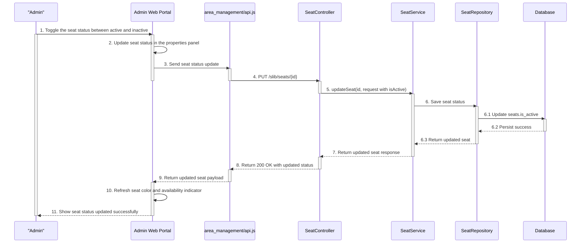

# FE-32 Change Seat Status

```mermaid
sequenceDiagram
    participant Users as "Admin"
    participant Client as Admin Web Portal
    participant LayoutApi as area_management/api.js
    participant SeatController as SeatController
    participant SeatService as SeatService
    participant SeatRepo as SeatRepository
    participant DB as Database

    Users->>Client: 1. Toggle the seat status between active and inactive
    activate Users
    activate Client
    Client->>Client: 2. Update seat status in the properties panel
    Client->>LayoutApi: 3. Send seat status update
    activate LayoutApi
    LayoutApi->>SeatController: 4. PUT /slib/seats/{id}
    deactivate LayoutApi
    deactivate Client
    activate SeatController
    SeatController->>SeatService: 5. updateSeat(id, request with isActive)
    deactivate SeatController
    activate SeatService
    SeatService->>SeatRepo: 6. Save seat status
    activate SeatRepo
    SeatRepo->>DB: 6.1 Update seats.is_active
    activate DB
    DB-->>SeatRepo: 6.2 Persist success
    deactivate DB
    SeatRepo-->>SeatService: 6.3 Return updated seat
    deactivate SeatRepo
    SeatService-->>SeatController: 7. Return updated seat response
    deactivate SeatService
    activate SeatController
    SeatController-->>LayoutApi: 8. Return 200 OK with updated status
    deactivate SeatController
    activate LayoutApi
    LayoutApi-->>Client: 9. Return updated seat payload
    deactivate LayoutApi
    activate Client
    Client->>Client: 10. Refresh seat color and availability indicator
    Client-->>Users: 11. Show seat status updated successfully
    deactivate Client
    deactivate Users
```
