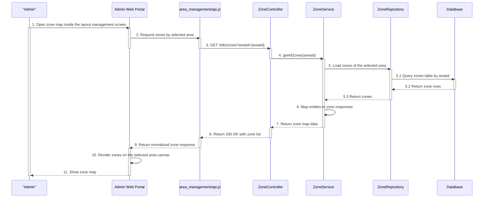

# FE-25 View Zone Map

```mermaid
sequenceDiagram
    participant Users as "Admin"
    participant Client as Admin Web Portal
    participant LayoutApi as area_management/api.js
    participant ZoneController as ZoneController
    participant ZoneService as ZoneService
    participant ZoneRepo as ZoneRepository
    participant DB as Database

    Users->>Client: 1. Open zone map inside the layout management screen
    activate Users
    activate Client
    Client->>LayoutApi: 2. Request zones by selected area
    activate LayoutApi
    LayoutApi->>ZoneController: 3. GET /slib/zones?areaId={areaId}
    deactivate LayoutApi
    deactivate Client
    activate ZoneController
    ZoneController->>ZoneService: 4. getAllZones(areaId)
    deactivate ZoneController
    activate ZoneService
    ZoneService->>ZoneRepo: 5. Load zones of the selected area
    activate ZoneRepo
    ZoneRepo->>DB: 5.1 Query zones table by areaId
    activate DB
    DB-->>ZoneRepo: 5.2 Return zone rows
    deactivate DB
    ZoneRepo-->>ZoneService: 5.3 Return zones
    deactivate ZoneRepo
    ZoneService->>ZoneService: 6. Map entities to zone responses
    ZoneService-->>ZoneController: 7. Return zone map data
    deactivate ZoneService
    activate ZoneController
    ZoneController-->>LayoutApi: 8. Return 200 OK with zone list
    deactivate ZoneController
    activate LayoutApi
    LayoutApi-->>Client: 9. Return normalized zone response
    deactivate LayoutApi
    activate Client
    Client->>Client: 10. Render zones on the selected area canvas
    Client-->>Users: 11. Show zone map
    deactivate Client
    deactivate Users
```
