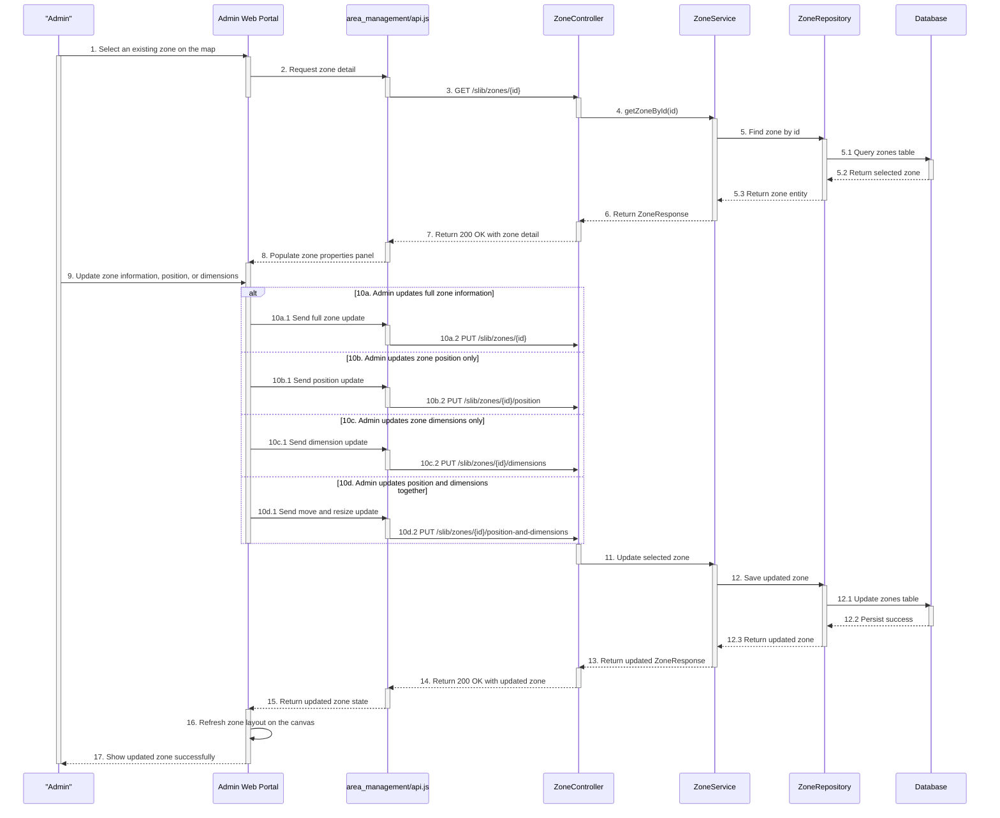

# FE-26a View and Update Zone

```mermaid
sequenceDiagram
    participant Users as "Admin"
    participant Client as Admin Web Portal
    participant LayoutApi as area_management/api.js
    participant ZoneController as ZoneController
    participant ZoneService as ZoneService
    participant ZoneRepo as ZoneRepository
    participant DB as Database

    Users->>Client: 1. Select an existing zone on the map
    activate Users
    activate Client
    Client->>LayoutApi: 2. Request zone detail
    activate LayoutApi
    LayoutApi->>ZoneController: 3. GET /slib/zones/{id}
    deactivate LayoutApi
    deactivate Client
    activate ZoneController
    ZoneController->>ZoneService: 4. getZoneById(id)
    deactivate ZoneController
    activate ZoneService
    ZoneService->>ZoneRepo: 5. Find zone by id
    activate ZoneRepo
    ZoneRepo->>DB: 5.1 Query zones table
    activate DB
    DB-->>ZoneRepo: 5.2 Return selected zone
    deactivate DB
    ZoneRepo-->>ZoneService: 5.3 Return zone entity
    deactivate ZoneRepo
    ZoneService-->>ZoneController: 6. Return ZoneResponse
    deactivate ZoneService
    activate ZoneController
    ZoneController-->>LayoutApi: 7. Return 200 OK with zone detail
    deactivate ZoneController
    activate LayoutApi
    LayoutApi-->>Client: 8. Populate zone properties panel
    deactivate LayoutApi
    activate Client
    Users->>Client: 9. Update zone information, position, or dimensions

    alt 10a. Admin updates full zone information
        Client->>LayoutApi: 10a.1 Send full zone update
        activate LayoutApi
        LayoutApi->>ZoneController: 10a.2 PUT /slib/zones/{id}
        deactivate LayoutApi
    else 10b. Admin updates zone position only
        Client->>LayoutApi: 10b.1 Send position update
        activate LayoutApi
        LayoutApi->>ZoneController: 10b.2 PUT /slib/zones/{id}/position
        deactivate LayoutApi
    else 10c. Admin updates zone dimensions only
        Client->>LayoutApi: 10c.1 Send dimension update
        activate LayoutApi
        LayoutApi->>ZoneController: 10c.2 PUT /slib/zones/{id}/dimensions
        deactivate LayoutApi
    else 10d. Admin updates position and dimensions together
        Client->>LayoutApi: 10d.1 Send move and resize update
        activate LayoutApi
        LayoutApi->>ZoneController: 10d.2 PUT /slib/zones/{id}/position-and-dimensions
        deactivate LayoutApi
    end

    deactivate Client
    activate ZoneController
    ZoneController->>ZoneService: 11. Update selected zone
    deactivate ZoneController
    activate ZoneService
    ZoneService->>ZoneRepo: 12. Save updated zone
    activate ZoneRepo
    ZoneRepo->>DB: 12.1 Update zones table
    activate DB
    DB-->>ZoneRepo: 12.2 Persist success
    deactivate DB
    ZoneRepo-->>ZoneService: 12.3 Return updated zone
    deactivate ZoneRepo
    ZoneService-->>ZoneController: 13. Return updated ZoneResponse
    deactivate ZoneService
    activate ZoneController
    ZoneController-->>LayoutApi: 14. Return 200 OK with updated zone
    deactivate ZoneController
    activate LayoutApi
    LayoutApi-->>Client: 15. Return updated zone state
    deactivate LayoutApi
    activate Client
    Client->>Client: 16. Refresh zone layout on the canvas
    Client-->>Users: 17. Show updated zone successfully
    deactivate Client
    deactivate Users
```
