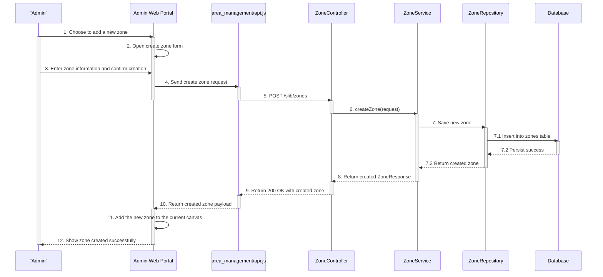

# FE-26b Create Zone

```mermaid
sequenceDiagram
    participant Users as "Admin"
    participant Client as Admin Web Portal
    participant LayoutApi as area_management/api.js
    participant ZoneController as ZoneController
    participant ZoneService as ZoneService
    participant ZoneRepo as ZoneRepository
    participant DB as Database

    Users->>Client: 1. Choose to add a new zone
    activate Users
    activate Client
    Client->>Client: 2. Open create zone form
    Users->>Client: 3. Enter zone information and confirm creation
    Client->>LayoutApi: 4. Send create zone request
    activate LayoutApi
    LayoutApi->>ZoneController: 5. POST /slib/zones
    deactivate LayoutApi
    deactivate Client
    activate ZoneController
    ZoneController->>ZoneService: 6. createZone(request)
    deactivate ZoneController
    activate ZoneService
    ZoneService->>ZoneRepo: 7. Save new zone
    activate ZoneRepo
    ZoneRepo->>DB: 7.1 Insert into zones table
    activate DB
    DB-->>ZoneRepo: 7.2 Persist success
    deactivate DB
    ZoneRepo-->>ZoneService: 7.3 Return created zone
    deactivate ZoneRepo
    ZoneService-->>ZoneController: 8. Return created ZoneResponse
    deactivate ZoneService
    activate ZoneController
    ZoneController-->>LayoutApi: 9. Return 200 OK with created zone
    deactivate ZoneController
    activate LayoutApi
    LayoutApi-->>Client: 10. Return created zone payload
    deactivate LayoutApi
    activate Client
    Client->>Client: 11. Add the new zone to the current canvas
    Client-->>Users: 12. Show zone created successfully
    deactivate Client
    deactivate Users
```
