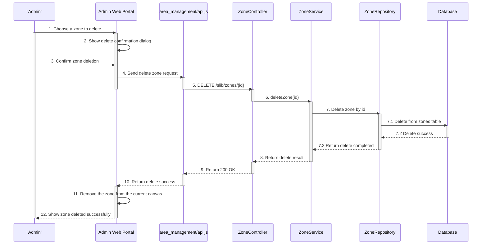

# FE-26c Delete Zone

```mermaid
sequenceDiagram
    participant Users as "Admin"
    participant Client as Admin Web Portal
    participant LayoutApi as area_management/api.js
    participant ZoneController as ZoneController
    participant ZoneService as ZoneService
    participant ZoneRepo as ZoneRepository
    participant DB as Database

    Users->>Client: 1. Choose a zone to delete
    activate Users
    activate Client
    Client->>Client: 2. Show delete confirmation dialog
    Users->>Client: 3. Confirm zone deletion
    Client->>LayoutApi: 4. Send delete zone request
    activate LayoutApi
    LayoutApi->>ZoneController: 5. DELETE /slib/zones/{id}
    deactivate LayoutApi
    deactivate Client
    activate ZoneController
    ZoneController->>ZoneService: 6. deleteZone(id)
    deactivate ZoneController
    activate ZoneService
    ZoneService->>ZoneRepo: 7. Delete zone by id
    activate ZoneRepo
    ZoneRepo->>DB: 7.1 Delete from zones table
    activate DB
    DB-->>ZoneRepo: 7.2 Delete success
    deactivate DB
    ZoneRepo-->>ZoneService: 7.3 Return delete completed
    deactivate ZoneRepo
    ZoneService-->>ZoneController: 8. Return delete result
    deactivate ZoneService
    activate ZoneController
    ZoneController-->>LayoutApi: 9. Return 200 OK
    deactivate ZoneController
    activate LayoutApi
    LayoutApi-->>Client: 10. Return delete success
    deactivate LayoutApi
    activate Client
    Client->>Client: 11. Remove the zone from the current canvas
    Client-->>Users: 12. Show zone deleted successfully
    deactivate Client
    deactivate Users
```
