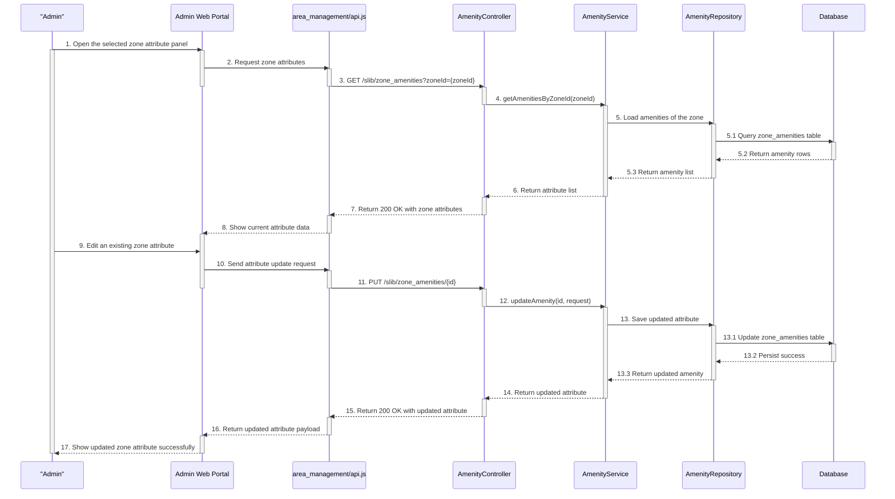

# FE-27a View and Update Zone Attribute

```mermaid
sequenceDiagram
    participant Users as "Admin"
    participant Client as Admin Web Portal
    participant LayoutApi as area_management/api.js
    participant AmenityController as AmenityController
    participant AmenityService as AmenityService
    participant AmenityRepo as AmenityRepository
    participant DB as Database

    Users->>Client: 1. Open the selected zone attribute panel
    activate Users
    activate Client
    Client->>LayoutApi: 2. Request zone attributes
    activate LayoutApi
    LayoutApi->>AmenityController: 3. GET /slib/zone_amenities?zoneId={zoneId}
    deactivate LayoutApi
    deactivate Client
    activate AmenityController
    AmenityController->>AmenityService: 4. getAmenitiesByZoneId(zoneId)
    deactivate AmenityController
    activate AmenityService
    AmenityService->>AmenityRepo: 5. Load amenities of the zone
    activate AmenityRepo
    AmenityRepo->>DB: 5.1 Query zone_amenities table
    activate DB
    DB-->>AmenityRepo: 5.2 Return amenity rows
    deactivate DB
    AmenityRepo-->>AmenityService: 5.3 Return amenity list
    deactivate AmenityRepo
    AmenityService-->>AmenityController: 6. Return attribute list
    deactivate AmenityService
    activate AmenityController
    AmenityController-->>LayoutApi: 7. Return 200 OK with zone attributes
    deactivate AmenityController
    activate LayoutApi
    LayoutApi-->>Client: 8. Show current attribute data
    deactivate LayoutApi
    activate Client
    Users->>Client: 9. Edit an existing zone attribute
    Client->>LayoutApi: 10. Send attribute update request
    activate LayoutApi
    LayoutApi->>AmenityController: 11. PUT /slib/zone_amenities/{id}
    deactivate LayoutApi
    deactivate Client
    activate AmenityController
    AmenityController->>AmenityService: 12. updateAmenity(id, request)
    deactivate AmenityController
    activate AmenityService
    AmenityService->>AmenityRepo: 13. Save updated attribute
    activate AmenityRepo
    AmenityRepo->>DB: 13.1 Update zone_amenities table
    activate DB
    DB-->>AmenityRepo: 13.2 Persist success
    deactivate DB
    AmenityRepo-->>AmenityService: 13.3 Return updated amenity
    deactivate AmenityRepo
    AmenityService-->>AmenityController: 14. Return updated attribute
    deactivate AmenityService
    activate AmenityController
    AmenityController-->>LayoutApi: 15. Return 200 OK with updated attribute
    deactivate AmenityController
    activate LayoutApi
    LayoutApi-->>Client: 16. Return updated attribute payload
    deactivate LayoutApi
    activate Client
    Client-->>Users: 17. Show updated zone attribute successfully
    deactivate Client
    deactivate Users
```
