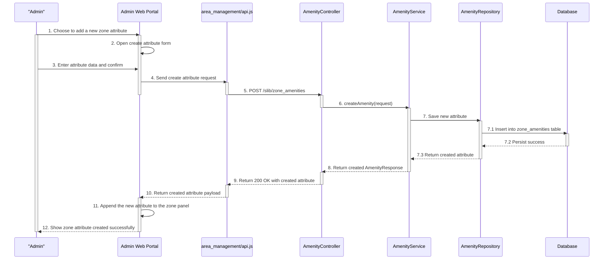

# FE-27b Create Zone Attribute

```mermaid
sequenceDiagram
    participant Users as "Admin"
    participant Client as Admin Web Portal
    participant LayoutApi as area_management/api.js
    participant AmenityController as AmenityController
    participant AmenityService as AmenityService
    participant AmenityRepo as AmenityRepository
    participant DB as Database

    Users->>Client: 1. Choose to add a new zone attribute
    activate Users
    activate Client
    Client->>Client: 2. Open create attribute form
    Users->>Client: 3. Enter attribute data and confirm
    Client->>LayoutApi: 4. Send create attribute request
    activate LayoutApi
    LayoutApi->>AmenityController: 5. POST /slib/zone_amenities
    deactivate LayoutApi
    deactivate Client
    activate AmenityController
    AmenityController->>AmenityService: 6. createAmenity(request)
    deactivate AmenityController
    activate AmenityService
    AmenityService->>AmenityRepo: 7. Save new attribute
    activate AmenityRepo
    AmenityRepo->>DB: 7.1 Insert into zone_amenities table
    activate DB
    DB-->>AmenityRepo: 7.2 Persist success
    deactivate DB
    AmenityRepo-->>AmenityService: 7.3 Return created attribute
    deactivate AmenityRepo
    AmenityService-->>AmenityController: 8. Return created AmenityResponse
    deactivate AmenityService
    activate AmenityController
    AmenityController-->>LayoutApi: 9. Return 200 OK with created attribute
    deactivate AmenityController
    activate LayoutApi
    LayoutApi-->>Client: 10. Return created attribute payload
    deactivate LayoutApi
    activate Client
    Client->>Client: 11. Append the new attribute to the zone panel
    Client-->>Users: 12. Show zone attribute created successfully
    deactivate Client
    deactivate Users
```
