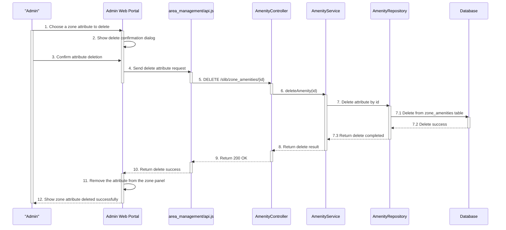

# FE-27c Delete Zone Attribute

```mermaid
sequenceDiagram
    participant Users as "Admin"
    participant Client as Admin Web Portal
    participant LayoutApi as area_management/api.js
    participant AmenityController as AmenityController
    participant AmenityService as AmenityService
    participant AmenityRepo as AmenityRepository
    participant DB as Database

    Users->>Client: 1. Choose a zone attribute to delete
    activate Users
    activate Client
    Client->>Client: 2. Show delete confirmation dialog
    Users->>Client: 3. Confirm attribute deletion
    Client->>LayoutApi: 4. Send delete attribute request
    activate LayoutApi
    LayoutApi->>AmenityController: 5. DELETE /slib/zone_amenities/{id}
    deactivate LayoutApi
    deactivate Client
    activate AmenityController
    AmenityController->>AmenityService: 6. deleteAmenity(id)
    deactivate AmenityController
    activate AmenityService
    AmenityService->>AmenityRepo: 7. Delete attribute by id
    activate AmenityRepo
    AmenityRepo->>DB: 7.1 Delete from zone_amenities table
    activate DB
    DB-->>AmenityRepo: 7.2 Delete success
    deactivate DB
    AmenityRepo-->>AmenityService: 7.3 Return delete completed
    deactivate AmenityRepo
    AmenityService-->>AmenityController: 8. Return delete result
    deactivate AmenityService
    activate AmenityController
    AmenityController-->>LayoutApi: 9. Return 200 OK
    deactivate AmenityController
    activate LayoutApi
    LayoutApi-->>Client: 10. Return delete success
    deactivate LayoutApi
    activate Client
    Client->>Client: 11. Remove the attribute from the zone panel
    Client-->>Users: 12. Show zone attribute deleted successfully
    deactivate Client
    deactivate Users
```
