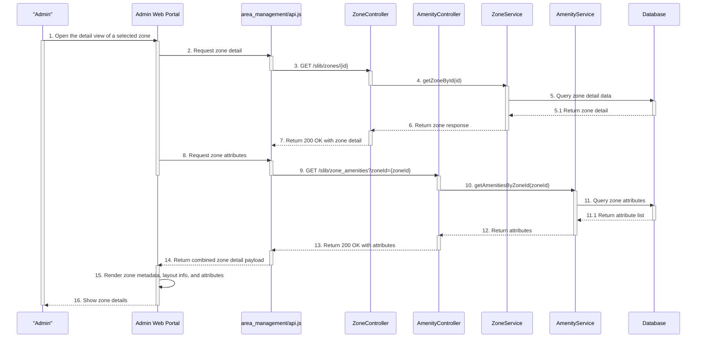

# FE-28 View Zone Details

```mermaid
sequenceDiagram
    participant Users as "Admin"
    participant Client as Admin Web Portal
    participant LayoutApi as area_management/api.js
    participant ZoneController as ZoneController
    participant AmenityController as AmenityController
    participant ZoneService as ZoneService
    participant AmenityService as AmenityService
    participant DB as Database

    Users->>Client: 1. Open the detail view of a selected zone
    activate Users
    activate Client
    Client->>LayoutApi: 2. Request zone detail
    activate LayoutApi
    LayoutApi->>ZoneController: 3. GET /slib/zones/{id}
    deactivate LayoutApi
    activate ZoneController
    ZoneController->>ZoneService: 4. getZoneById(id)
    deactivate ZoneController
    activate ZoneService
    ZoneService->>DB: 5. Query zone detail data
    activate DB
    DB-->>ZoneService: 5.1 Return zone detail
    deactivate DB
    ZoneService-->>ZoneController: 6. Return zone response
    deactivate ZoneService
    activate ZoneController
    ZoneController-->>LayoutApi: 7. Return 200 OK with zone detail
    deactivate ZoneController

    Client->>LayoutApi: 8. Request zone attributes
    activate LayoutApi
    LayoutApi->>AmenityController: 9. GET /slib/zone_amenities?zoneId={zoneId}
    deactivate LayoutApi
    deactivate Client
    activate AmenityController
    AmenityController->>AmenityService: 10. getAmenitiesByZoneId(zoneId)
    deactivate AmenityController
    activate AmenityService
    AmenityService->>DB: 11. Query zone attributes
    activate DB
    DB-->>AmenityService: 11.1 Return attribute list
    deactivate DB
    AmenityService-->>AmenityController: 12. Return attributes
    deactivate AmenityService
    activate AmenityController
    AmenityController-->>LayoutApi: 13. Return 200 OK with attributes
    deactivate AmenityController
    activate LayoutApi
    LayoutApi-->>Client: 14. Return combined zone detail payload
    deactivate LayoutApi
    activate Client
    Client->>Client: 15. Render zone metadata, layout info, and attributes
    Client-->>Users: 16. Show zone details
    deactivate Client
    deactivate Users
```
