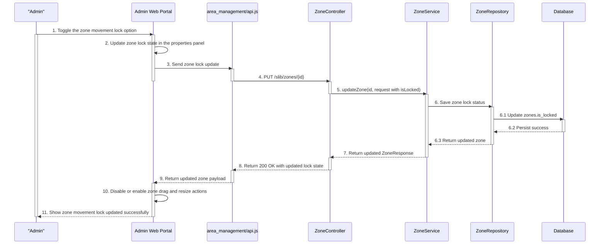

# FE-29 Lock Zone Movement

```mermaid
sequenceDiagram
    participant Users as "Admin"
    participant Client as Admin Web Portal
    participant LayoutApi as area_management/api.js
    participant ZoneController as ZoneController
    participant ZoneService as ZoneService
    participant ZoneRepo as ZoneRepository
    participant DB as Database

    Users->>Client: 1. Toggle the zone movement lock option
    activate Users
    activate Client
    Client->>Client: 2. Update zone lock state in the properties panel
    Client->>LayoutApi: 3. Send zone lock update
    activate LayoutApi
    LayoutApi->>ZoneController: 4. PUT /slib/zones/{id}
    deactivate LayoutApi
    deactivate Client
    activate ZoneController
    ZoneController->>ZoneService: 5. updateZone(id, request with isLocked)
    deactivate ZoneController
    activate ZoneService
    ZoneService->>ZoneRepo: 6. Save zone lock status
    activate ZoneRepo
    ZoneRepo->>DB: 6.1 Update zones.is_locked
    activate DB
    DB-->>ZoneRepo: 6.2 Persist success
    deactivate DB
    ZoneRepo-->>ZoneService: 6.3 Return updated zone
    deactivate ZoneRepo
    ZoneService-->>ZoneController: 7. Return updated ZoneResponse
    deactivate ZoneService
    activate ZoneController
    ZoneController-->>LayoutApi: 8. Return 200 OK with updated lock state
    deactivate ZoneController
    activate LayoutApi
    LayoutApi-->>Client: 9. Return updated zone payload
    deactivate LayoutApi
    activate Client
    Client->>Client: 10. Disable or enable zone drag and resize actions
    Client-->>Users: 11. Show zone movement lock updated successfully
    deactivate Client
    deactivate Users
```
