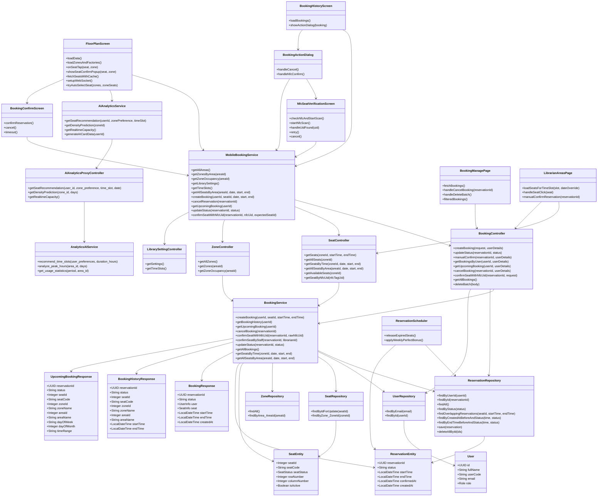

# Booking Seat Module Class Diagram

```mermaid
classDiagram
    class BookingController {
        +createBooking(request, userDetails)
        +updateStatus(reservationId, status)
        +manualConfirm(reservationId, userDetails)
        +getBookingsByUser(userId, userDetails)
        +getUpcomingBooking(userId, userDetails)
        +cancelBooking(reservationId, userDetails)
        +confirmSeatWithNfcUid(reservationId, request)
        +getAllBookings()
        +deleteBatch(body)
    }

    class BookingService {
        +createBooking(userId, seatId, startTime, endTime)
        +getBookingHistory(userId)
        +getUpcomingBooking(userId)
        +cancelBooking(reservationId)
        +confirmSeatWithNfcUid(reservationId, rawNfcUid)
        +confirmSeatByStaff(reservationId, librarianId)
        +updateStatus(reservationId, status)
        +getAllBookings()
        +getSeatsByTime(zoneId, date, start, end)
        +getAllSeatsByArea(areaId, date, start, end)
    }

    class ReservationScheduler {
        +releaseExpiredSeats()
        +applyWeeklyPerfectBonus()
    }

    class SeatController {
        +getSeats(zoneId, startTime, endTime)
        +getAllSeats(zoneId)
        +getSeatsByTime(zoneId, date, start, end)
        +getAllSeatsByArea(areaId, date, start, end)
        +getAvailableSeats(zoneId)
        +getSeatByNfcUid(nfcTagUid)
    }

    class ZoneController {
        +getAllZones()
        +getZones(areaId)
        +getZoneOccupancy(areaId)
    }

    class LibrarySettingController {
        +getSettings()
        +getTimeSlots()
    }

    class AIAnalyticsProxyController {
        +getSeatRecommendation(user_id, zone_preference, time_slot, date)
        +getDensityPrediction(zone_id, days)
        +getRealtimeCapacity()
    }

    class AnalyticsAIService {
        +recommend_time_slots(user_preferences, duration_hours)
        +analyze_peak_hours(area_id, days)
        +get_usage_statistics(period, area_id)
    }

    class MobileBookingService {
        +getAllAreas()
        +getZonesByArea(areaId)
        +getZoneOccupancy(areaId)
        +getLibrarySettings()
        +getTimeSlots()
        +getAllSeatsByArea(areaId, date, start, end)
        +createBooking(userId, seatId, date, start, end)
        +cancelReservation(reservationId)
        +getUpcomingBooking(userId)
        +updateStatus(reservationId, status)
        +confirmSeatWithNfcUid(reservationId, nfcUid, expectedSeatId)
    }

    class AIAnalyticsService {
        +getSeatRecommendation(userId, zonePreference, timeSlot)
        +getDensityPrediction(zoneId)
        +getRealtimeCapacity()
        +generateAICardData(userId)
    }

    class FloorPlanScreen {
        +loadData()
        +loadZonesAndFactories()
        +onSeatTap(seat, zone)
        +showSeatConfirmPopup(seat, zone)
        +fetchSeatsWithCache()
        +setupWebSocket()
        +tryAutoSelectSeat(zones, zoneSeats)
    }

    class BookingConfirmScreen {
        +confirmReservation()
        +cancel()
        +timeout()
    }

    class BookingHistoryScreen {
        +loadBookings()
        +showActionDialog(booking)
    }

    class BookingActionDialog {
        +handleCancel()
        +handleNfcConfirm()
    }

    class NfcSeatVerificationScreen {
        +checkNfcAndStartScan()
        +startNfcScan()
        +handleUidFound(uid)
        +retry()
        +cancel()
    }

    class BookingManagePage {
        +fetchBookings()
        +handleCancelBooking(reservationId)
        +handleDeleteBatch()
        +filteredBookings()
    }

    class LibrarianAreasPage {
        +loadSeatsForTimeSlot(slot, dateOverride)
        +handleSeatClick(seat)
        +manualConfirmReservation(reservationId)
    }

    class ReservationRepository {
        +findByUserId(userId)
        +findById(reservationId)
        +findAll()
        +findByStatus(status)
        +findOverlappingReservations(seatId, startTime, endTime)
        +findByCreatedAtBeforeAndStatus(time, status)
        +findByEndTimeBeforeAndStatus(time, status)
        +save(reservation)
        +deleteAllById(ids)
    }

    class UserRepository {
        +findByEmail(email)
        +findById(userId)
    }

    class SeatRepository {
        +findByIdForUpdate(seatId)
        +findByZone_ZoneId(zoneId)
    }

    class ZoneRepository {
        +findAll()
        +findByArea_AreaId(areaId)
    }

    class ReservationEntity {
        +UUID reservationId
        +String status
        +LocalDateTime startTime
        +LocalDateTime endTime
        +LocalDateTime confirmedAt
        +LocalDateTime createdAt
    }

    class SeatEntity {
        +Integer seatId
        +String seatCode
        +SeatStatus seatStatus
        +Integer rowNumber
        +Integer columnNumber
        +Boolean isActive
    }

    class User {
        +UUID id
        +String fullName
        +String userCode
        +String email
        +Role role
    }

    class BookingResponse {
        +UUID reservationId
        +String status
        +UserInfo user
        +SeatInfo seat
        +LocalDateTime startTime
        +LocalDateTime endTime
        +LocalDateTime createdAt
    }

    class BookingHistoryResponse {
        +UUID reservationId
        +String status
        +Integer seatId
        +String seatCode
        +Integer zoneId
        +String zoneName
        +Integer areaId
        +String areaName
        +LocalDateTime startTime
        +LocalDateTime endTime
    }

    class UpcomingBookingResponse {
        +UUID reservationId
        +String status
        +Integer seatId
        +String seatCode
        +Integer zoneId
        +String zoneName
        +Integer areaId
        +String areaName
        +String dayOfWeek
        +Integer dayOfMonth
        +String timeRange
    }

    BookingController --> BookingService
    BookingController --> ReservationRepository
    BookingController --> UserRepository
    BookingService --> ReservationRepository
    BookingService --> UserRepository
    BookingService --> SeatRepository
    BookingService --> ZoneRepository
    BookingService --> SeatEntity
    BookingService --> ReservationEntity
    BookingService --> BookingResponse
    BookingService --> BookingHistoryResponse
    BookingService --> UpcomingBookingResponse
    ReservationScheduler --> ReservationRepository
    ReservationScheduler --> ReservationEntity
    SeatController --> BookingService
    ZoneController --> BookingService
    AIAnalyticsProxyController --> AnalyticsAIService
    MobileBookingService --> BookingController
    MobileBookingService --> SeatController
    MobileBookingService --> ZoneController
    MobileBookingService --> LibrarySettingController
    AIAnalyticsService --> AIAnalyticsProxyController
    FloorPlanScreen --> MobileBookingService
    FloorPlanScreen --> AIAnalyticsService
    FloorPlanScreen --> BookingConfirmScreen
    BookingConfirmScreen --> MobileBookingService
    BookingHistoryScreen --> MobileBookingService
    BookingHistoryScreen --> BookingActionDialog
    BookingActionDialog --> NfcSeatVerificationScreen
    BookingActionDialog --> MobileBookingService
    NfcSeatVerificationScreen --> MobileBookingService
    BookingManagePage --> BookingController
    LibrarianAreasPage --> SeatController
    LibrarianAreasPage --> BookingController
    ReservationRepository --> ReservationEntity
    SeatRepository --> SeatEntity
    UserRepository --> User
```
