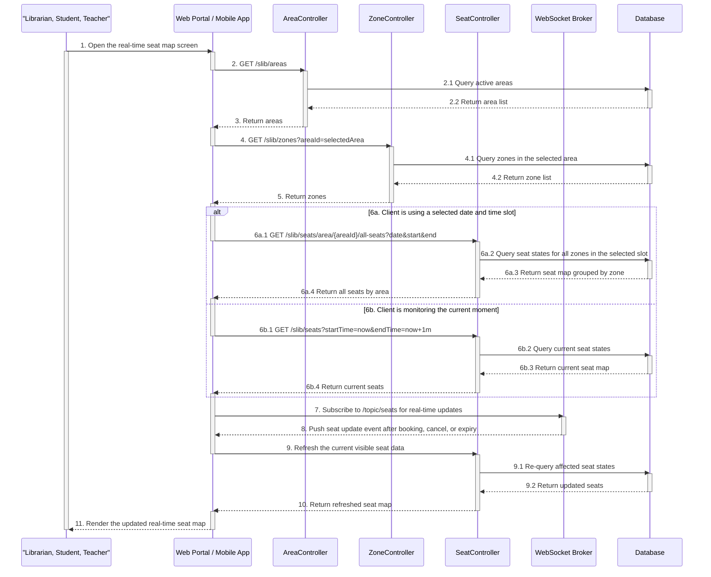

# FE-60 View Real Time Seat Map

```mermaid
sequenceDiagram
    participant Users as "Librarian, Student, Teacher"
    participant Client as Web Portal / Mobile App
    participant AreaController as AreaController
    participant ZoneController as ZoneController
    participant SeatController as SeatController
    participant Broker as WebSocket Broker
    participant DB as Database

    Users->>Client: 1. Open the real-time seat map screen
    activate Users
    activate Client
    Client->>AreaController: 2. GET /slib/areas
    deactivate Client
    activate AreaController
    AreaController->>DB: 2.1 Query active areas
    activate DB
    DB-->>AreaController: 2.2 Return area list
    deactivate DB
    AreaController-->>Client: 3. Return areas
    deactivate AreaController
    activate Client
    Client->>ZoneController: 4. GET /slib/zones?areaId=selectedArea
    deactivate Client
    activate ZoneController
    ZoneController->>DB: 4.1 Query zones in the selected area
    activate DB
    DB-->>ZoneController: 4.2 Return zone list
    deactivate DB
    ZoneController-->>Client: 5. Return zones
    deactivate ZoneController
    activate Client

    alt 6a. Client is using a selected date and time slot
        Client->>SeatController: 6a.1 GET /slib/seats/area/{areaId}/all-seats?date&start&end
        deactivate Client
        activate SeatController
        SeatController->>DB: 6a.2 Query seat states for all zones in the selected slot
        activate DB
        DB-->>SeatController: 6a.3 Return seat map grouped by zone
        deactivate DB
        SeatController-->>Client: 6a.4 Return all seats by area
        deactivate SeatController
        activate Client
    else 6b. Client is monitoring the current moment
        Client->>SeatController: 6b.1 GET /slib/seats?startTime=now&endTime=now+1m
        deactivate Client
        activate SeatController
        SeatController->>DB: 6b.2 Query current seat states
        activate DB
        DB-->>SeatController: 6b.3 Return current seat map
        deactivate DB
        SeatController-->>Client: 6b.4 Return current seats
        deactivate SeatController
        activate Client
    end

    Client->>Broker: 7. Subscribe to /topic/seats for real-time updates
    activate Broker
    Broker-->>Client: 8. Push seat update event after booking, cancel, or expiry
    deactivate Broker
    Client->>SeatController: 9. Refresh the current visible seat data
    deactivate Client
    activate SeatController
    SeatController->>DB: 9.1 Re-query affected seat states
    activate DB
    DB-->>SeatController: 9.2 Return updated seats
    deactivate DB
    SeatController-->>Client: 10. Return refreshed seat map
    deactivate SeatController
    activate Client
    Client-->>Users: 11. Render the updated real-time seat map
    deactivate Client
    deactivate Users
```
