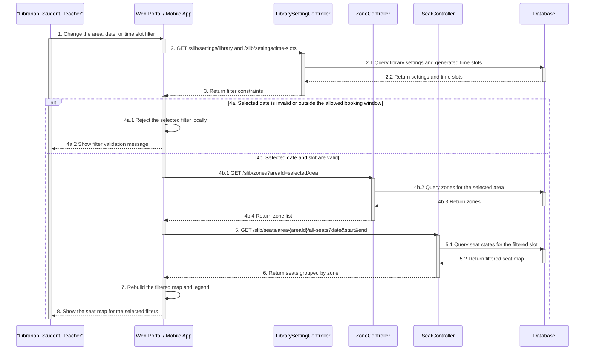

# FE-61 Filter Seat Map

```mermaid
sequenceDiagram
    participant Users as "Librarian, Student, Teacher"
    participant Client as Web Portal / Mobile App
    participant LibrarySettingController as LibrarySettingController
    participant ZoneController as ZoneController
    participant SeatController as SeatController
    participant DB as Database

    Users->>Client: 1. Change the area, date, or time slot filter
    activate Users
    activate Client
    Client->>LibrarySettingController: 2. GET /slib/settings/library and /slib/settings/time-slots
    deactivate Client
    activate LibrarySettingController
    LibrarySettingController->>DB: 2.1 Query library settings and generated time slots
    activate DB
    DB-->>LibrarySettingController: 2.2 Return settings and time slots
    deactivate DB
    LibrarySettingController-->>Client: 3. Return filter constraints
    deactivate LibrarySettingController
    activate Client

    alt 4a. Selected date is invalid or outside the allowed booking window
        Client->>Client: 4a.1 Reject the selected filter locally
        Client-->>Users: 4a.2 Show filter validation message
    else 4b. Selected date and slot are valid
        Client->>ZoneController: 4b.1 GET /slib/zones?areaId=selectedArea
        deactivate Client
        activate ZoneController
        ZoneController->>DB: 4b.2 Query zones for the selected area
        activate DB
        DB-->>ZoneController: 4b.3 Return zones
        deactivate DB
        ZoneController-->>Client: 4b.4 Return zone list
        deactivate ZoneController
        activate Client
        Client->>SeatController: 5. GET /slib/seats/area/{areaId}/all-seats?date&start&end
        deactivate Client
        activate SeatController
        SeatController->>DB: 5.1 Query seat states for the filtered slot
        activate DB
        DB-->>SeatController: 5.2 Return filtered seat map
        deactivate DB
        SeatController-->>Client: 6. Return seats grouped by zone
        deactivate SeatController
        activate Client
        Client->>Client: 7. Rebuild the filtered map and legend
        Client-->>Users: 8. Show the seat map for the selected filters
    end

    deactivate Client
    deactivate Users
```
