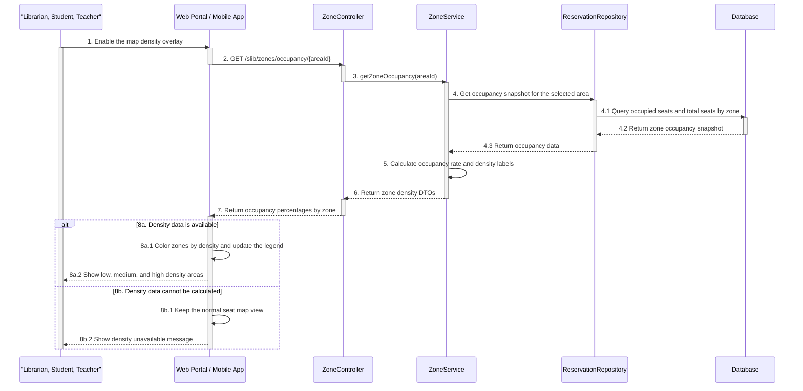

# FE-62 View Map Density

```mermaid
sequenceDiagram
    participant Users as "Librarian, Student, Teacher"
    participant Client as Web Portal / Mobile App
    participant ZoneController as ZoneController
    participant ZoneService as ZoneService
    participant ReservationRepo as ReservationRepository
    participant DB as Database

    Users->>Client: 1. Enable the map density overlay
    activate Users
    activate Client
    Client->>ZoneController: 2. GET /slib/zones/occupancy/{areaId}
    deactivate Client
    activate ZoneController
    ZoneController->>ZoneService: 3. getZoneOccupancy(areaId)
    deactivate ZoneController
    activate ZoneService
    ZoneService->>ReservationRepo: 4. Get occupancy snapshot for the selected area
    activate ReservationRepo
    ReservationRepo->>DB: 4.1 Query occupied seats and total seats by zone
    activate DB
    DB-->>ReservationRepo: 4.2 Return zone occupancy snapshot
    deactivate DB
    ReservationRepo-->>ZoneService: 4.3 Return occupancy data
    deactivate ReservationRepo
    ZoneService->>ZoneService: 5. Calculate occupancy rate and density labels
    ZoneService-->>ZoneController: 6. Return zone density DTOs
    deactivate ZoneService
    activate ZoneController
    ZoneController-->>Client: 7. Return occupancy percentages by zone
    deactivate ZoneController
    activate Client

    alt 8a. Density data is available
        Client->>Client: 8a.1 Color zones by density and update the legend
        Client-->>Users: 8a.2 Show low, medium, and high density areas
    else 8b. Density data cannot be calculated
        Client->>Client: 8b.1 Keep the normal seat map view
        Client-->>Users: 8b.2 Show density unavailable message
    end

    deactivate Client
    deactivate Users
```
