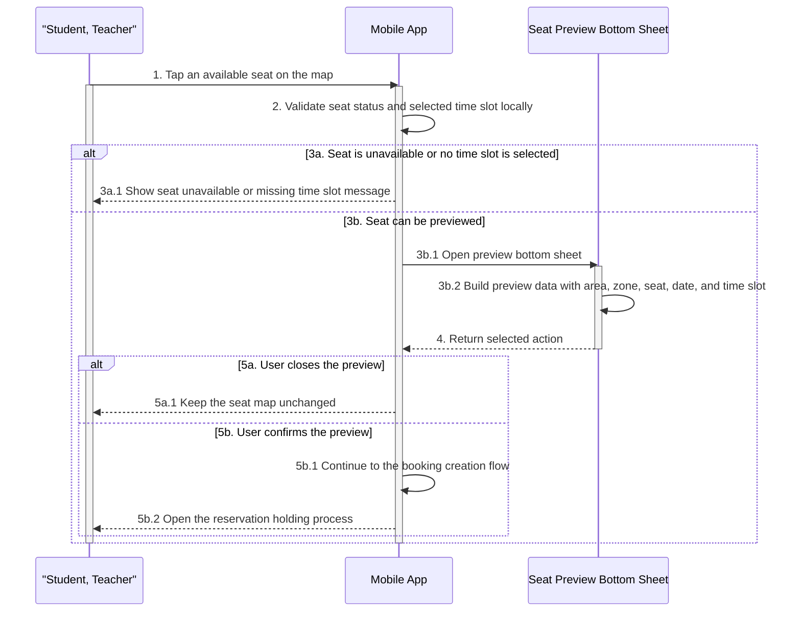

# FE-64 Preview Booking Information

```mermaid
sequenceDiagram
    participant Users as "Student, Teacher"
    participant Client as Mobile App
    participant PreviewModal as Seat Preview Bottom Sheet

    Users->>Client: 1. Tap an available seat on the map
    activate Users
    activate Client
    Client->>Client: 2. Validate seat status and selected time slot locally

    alt 3a. Seat is unavailable or no time slot is selected
        Client-->>Users: 3a.1 Show seat unavailable or missing time slot message
    else 3b. Seat can be previewed
        Client->>PreviewModal: 3b.1 Open preview bottom sheet
        activate PreviewModal
        PreviewModal->>PreviewModal: 3b.2 Build preview data with area, zone, seat, date, and time slot
        PreviewModal-->>Client: 4. Return selected action
        deactivate PreviewModal

        alt 5a. User closes the preview
            Client-->>Users: 5a.1 Keep the seat map unchanged
        else 5b. User confirms the preview
            Client->>Client: 5b.1 Continue to the booking creation flow
            Client-->>Users: 5b.2 Open the reservation holding process
        end
    end

    deactivate Client
    deactivate Users
```
