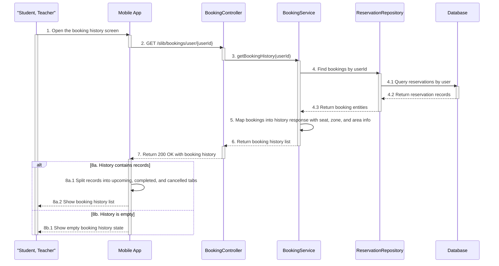

# FE-66 View History of Booking

```mermaid
sequenceDiagram
    participant Users as "Student, Teacher"
    participant Client as Mobile App
    participant BookingController as BookingController
    participant BookingService as BookingService
    participant ReservationRepo as ReservationRepository
    participant DB as Database

    Users->>Client: 1. Open the booking history screen
    activate Users
    activate Client
    Client->>BookingController: 2. GET /slib/bookings/user/{userId}
    deactivate Client
    activate BookingController
    BookingController->>BookingService: 3. getBookingHistory(userId)
    deactivate BookingController
    activate BookingService
    BookingService->>ReservationRepo: 4. Find bookings by userId
    activate ReservationRepo
    ReservationRepo->>DB: 4.1 Query reservations by user
    activate DB
    DB-->>ReservationRepo: 4.2 Return reservation records
    deactivate DB
    ReservationRepo-->>BookingService: 4.3 Return booking entities
    deactivate ReservationRepo
    BookingService->>BookingService: 5. Map bookings into history response with seat, zone, and area info
    BookingService-->>BookingController: 6. Return booking history list
    deactivate BookingService
    activate BookingController
    BookingController-->>Client: 7. Return 200 OK with booking history
    deactivate BookingController
    activate Client

    alt 8a. History contains records
        Client->>Client: 8a.1 Split records into upcoming, completed, and cancelled tabs
        Client-->>Users: 8a.2 Show booking history list
    else 8b. History is empty
        Client-->>Users: 8b.1 Show empty booking history state
    end

    deactivate Client
    deactivate Users
```
