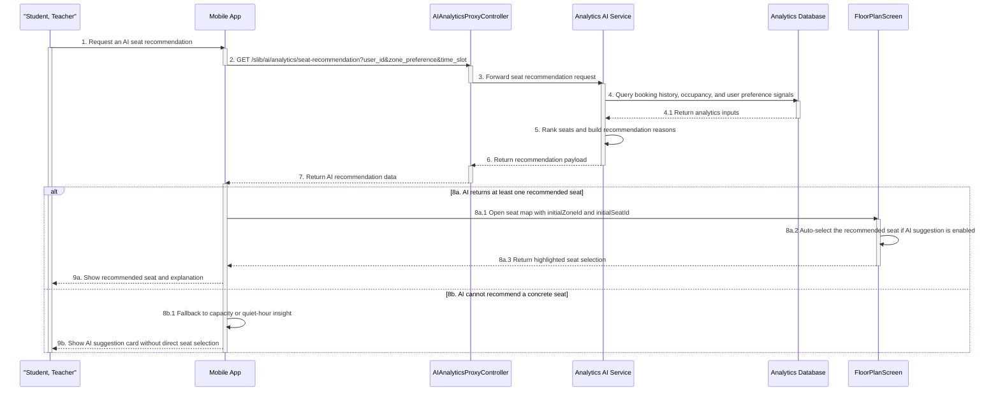

# FE-68 Ask AI for Recommending Seat

```mermaid
sequenceDiagram
    participant Users as "Student, Teacher"
    participant Client as Mobile App
    participant AIProxy as AIAnalyticsProxyController
    participant AIService as Analytics AI Service
    participant DB as Analytics Database
    participant FloorPlan as FloorPlanScreen

    Users->>Client: 1. Request an AI seat recommendation
    activate Users
    activate Client
    Client->>AIProxy: 2. GET /slib/ai/analytics/seat-recommendation?user_id&zone_preference&time_slot
    deactivate Client
    activate AIProxy
    AIProxy->>AIService: 3. Forward seat recommendation request
    deactivate AIProxy
    activate AIService
    AIService->>DB: 4. Query booking history, occupancy, and user preference signals
    activate DB
    DB-->>AIService: 4.1 Return analytics inputs
    deactivate DB
    AIService->>AIService: 5. Rank seats and build recommendation reasons
    AIService-->>AIProxy: 6. Return recommendation payload
    deactivate AIService
    activate AIProxy
    AIProxy-->>Client: 7. Return AI recommendation data
    deactivate AIProxy
    activate Client

    alt 8a. AI returns at least one recommended seat
        Client->>FloorPlan: 8a.1 Open seat map with initialZoneId and initialSeatId
        activate FloorPlan
        FloorPlan->>FloorPlan: 8a.2 Auto-select the recommended seat if AI suggestion is enabled
        FloorPlan-->>Client: 8a.3 Return highlighted seat selection
        deactivate FloorPlan
        Client-->>Users: 9a. Show recommended seat and explanation
    else 8b. AI cannot recommend a concrete seat
        Client->>Client: 8b.1 Fallback to capacity or quiet-hour insight
        Client-->>Users: 9b. Show AI suggestion card without direct seat selection
    end

    deactivate Client
    deactivate Users
```
