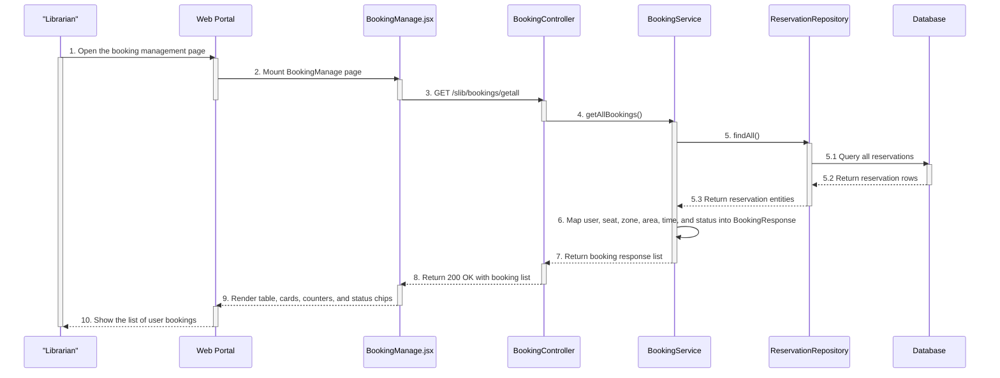

# FE-69 View List of User Bookings

```mermaid
sequenceDiagram
    participant Users as "Librarian"
    participant Client as Web Portal
    participant BookingPage as BookingManage.jsx
    participant BookingController as BookingController
    participant BookingService as BookingService
    participant ReservationRepo as ReservationRepository
    participant DB as Database

    Users->>Client: 1. Open the booking management page
    activate Users
    activate Client
    Client->>BookingPage: 2. Mount BookingManage page
    activate BookingPage
    BookingPage->>BookingController: 3. GET /slib/bookings/getall
    deactivate BookingPage
    deactivate Client
    activate BookingController
    BookingController->>BookingService: 4. getAllBookings()
    deactivate BookingController
    activate BookingService
    BookingService->>ReservationRepo: 5. findAll()
    activate ReservationRepo
    ReservationRepo->>DB: 5.1 Query all reservations
    activate DB
    DB-->>ReservationRepo: 5.2 Return reservation rows
    deactivate DB
    ReservationRepo-->>BookingService: 5.3 Return reservation entities
    deactivate ReservationRepo
    BookingService->>BookingService: 6. Map user, seat, zone, area, time, and status into BookingResponse
    BookingService-->>BookingController: 7. Return booking response list
    deactivate BookingService
    activate BookingController
    BookingController-->>BookingPage: 8. Return 200 OK with booking list
    deactivate BookingController
    activate BookingPage
    BookingPage-->>Client: 9. Render table, cards, counters, and status chips
    deactivate BookingPage
    activate Client
    Client-->>Users: 10. Show the list of user bookings
    deactivate Client
    deactivate Users
```
