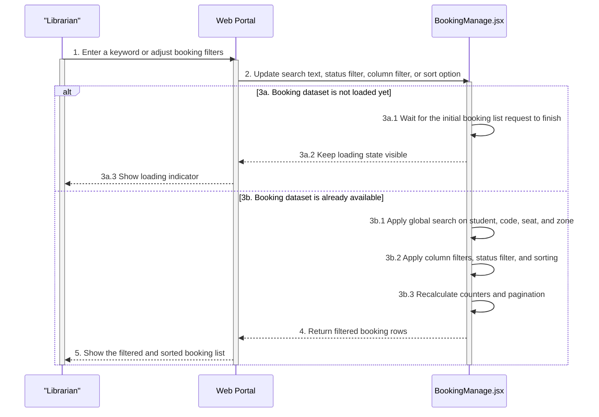

# FE-70 Search and Filter User Booking

```mermaid
sequenceDiagram
    participant Users as "Librarian"
    participant Client as Web Portal
    participant BookingPage as BookingManage.jsx

    Users->>Client: 1. Enter a keyword or adjust booking filters
    activate Users
    activate Client
    Client->>BookingPage: 2. Update search text, status filter, column filter, or sort option
    activate BookingPage

    alt 3a. Booking dataset is not loaded yet
        BookingPage->>BookingPage: 3a.1 Wait for the initial booking list request to finish
        BookingPage-->>Client: 3a.2 Keep loading state visible
        Client-->>Users: 3a.3 Show loading indicator
    else 3b. Booking dataset is already available
        BookingPage->>BookingPage: 3b.1 Apply global search on student, code, seat, and zone
        BookingPage->>BookingPage: 3b.2 Apply column filters, status filter, and sorting
        BookingPage->>BookingPage: 3b.3 Recalculate counters and pagination
        BookingPage-->>Client: 4. Return filtered booking rows
        Client-->>Users: 5. Show the filtered and sorted booking list
    end

    deactivate BookingPage
    deactivate Client
    deactivate Users
```
