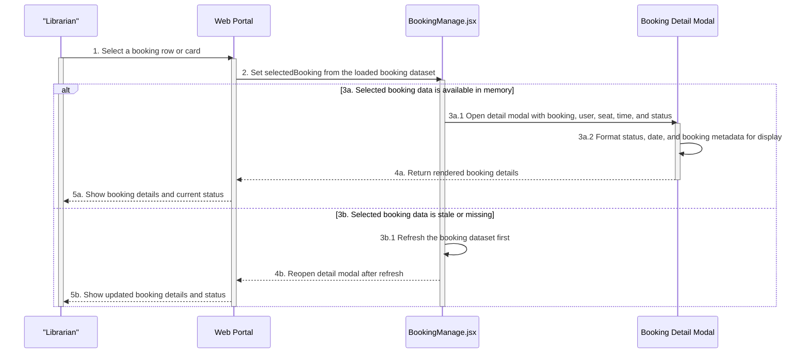

# FE-71 View User Booking Details

```mermaid
sequenceDiagram
    participant Users as "Librarian"
    participant Client as Web Portal
    participant BookingPage as BookingManage.jsx
    participant DetailModal as Booking Detail Modal

    Users->>Client: 1. Select a booking row or card
    activate Users
    activate Client
    Client->>BookingPage: 2. Set selectedBooking from the loaded booking dataset
    activate BookingPage

    alt 3a. Selected booking data is available in memory
        BookingPage->>DetailModal: 3a.1 Open detail modal with booking, user, seat, time, and status
        activate DetailModal
        DetailModal->>DetailModal: 3a.2 Format status, date, and booking metadata for display
        DetailModal-->>Client: 4a. Return rendered booking details
        deactivate DetailModal
        Client-->>Users: 5a. Show booking details and current status
    else 3b. Selected booking data is stale or missing
        BookingPage->>BookingPage: 3b.1 Refresh the booking dataset first
        BookingPage-->>Client: 4b. Reopen detail modal after refresh
        Client-->>Users: 5b. Show updated booking details and status
    end

    deactivate BookingPage
    deactivate Client
    deactivate Users
```
