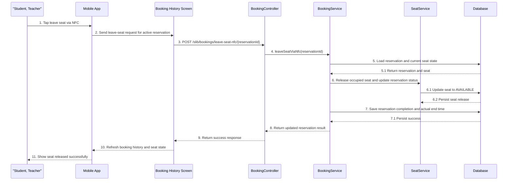

# FE-73 Leave Seat via NFC

```mermaid
sequenceDiagram
    participant Users as "Student, Teacher"
    participant Client as Mobile App
    participant BookingScreen as Booking History Screen
    participant BookingController as BookingController
    participant BookingService as BookingService
    participant SeatService as SeatService
    participant DB as Database

    Users->>Client: 1. Tap leave seat via NFC
    Client->>BookingScreen: 2. Send leave-seat request for active reservation
    BookingScreen->>BookingController: 3. POST /slib/bookings/leave-seat-nfc/{reservationId}
    BookingController->>BookingService: 4. leaveSeatViaNfc(reservationId)
    BookingService->>DB: 5. Load reservation and current seat state
    DB-->>BookingService: 5.1 Return reservation and seat
    BookingService->>SeatService: 6. Release occupied seat and update reservation status
    SeatService->>DB: 6.1 Update seat to AVAILABLE
    DB-->>SeatService: 6.2 Persist seat release
    BookingService->>DB: 7. Save reservation completion and actual end time
    DB-->>BookingService: 7.1 Persist success
    BookingService-->>BookingController: 8. Return updated reservation result
    BookingController-->>BookingScreen: 9. Return success response
    BookingScreen-->>Client: 10. Refresh booking history and seat state
    Client-->>Users: 11. Show seat released successfully
```
