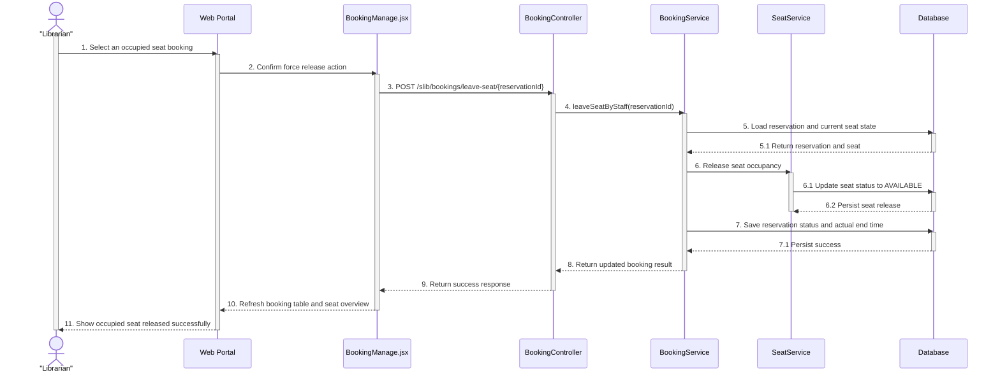

# FE-74 Release Occupied Seat by Librarian

```mermaid
sequenceDiagram
    actor Users as "Librarian"
    participant Client as Web Portal
    participant BookingPage as BookingManage.jsx
    participant BookingController as BookingController
    participant BookingService as BookingService
    participant SeatService as SeatService
    participant DB as Database

    activate Users
    Users->>Client: 1. Select an occupied seat booking
    activate Client
    
    Client->>BookingPage: 2. Confirm force release action
    activate BookingPage
    
    # Giai đoạn: Gọi API giải phóng chỗ (Staff Action)
    BookingPage->>BookingController: 3. POST /slib/bookings/leave-seat/{reservationId}
    activate BookingController
    
    BookingController->>BookingService: 4. leaveSeatByStaff(reservationId)
    activate BookingService
    
    # Bước 5: Kiểm tra thông tin phiên đặt chỗ
    BookingService->>DB: 5. Load reservation and current seat state
    activate DB
    DB-->>BookingService: 5.1 Return reservation and seat
    deactivate DB

    # Bước 6: Cưỡng chế giải phóng ghế thông qua SeatService
    BookingService->>SeatService: 6. Release seat occupancy
    activate SeatService
    SeatService->>DB: 6.1 Update seat status to AVAILABLE
    activate DB
    DB-->>SeatService: 6.2 Persist seat release
    deactivate DB
    deactivate SeatService
    
    # Bước 7: Cập nhật bản ghi Reservation
    BookingService->>DB: 7. Save reservation status and actual end time
    activate DB
    DB-->>BookingService: 7.1 Persist success
    deactivate DB

    # Phản hồi kết quả về UI Quản trị
    BookingService-->>BookingController: 8. Return updated booking result
    deactivate BookingService
    
    BookingController-->>BookingPage: 9. Return success response
    deactivate BookingController
    
    BookingPage-->>Client: 10. Refresh booking table and seat overview
    deactivate BookingPage
    
    Client-->>Users: 11. Show occupied seat released successfully
    
    deactivate Client
    deactivate Users
```
