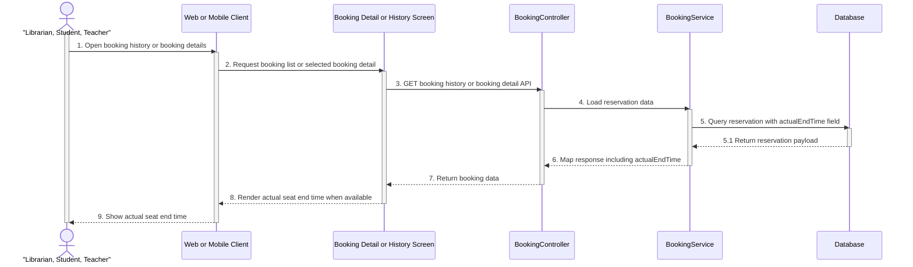

# FE-75 View Actual Seat End Time

```mermaid
sequenceDiagram
    actor Users as "Librarian, Student, Teacher"
    participant Client as Web or Mobile Client
    participant BookingScreen as Booking Detail or History Screen
    participant BookingController as BookingController
    participant BookingService as BookingService
    participant DB as Database

    activate Users
    Users->>Client: 1. Open booking history or booking details
    activate Client
    
    Client->>BookingScreen: 2. Request booking list or selected booking detail
    activate BookingScreen
    
    # Giai đoạn: Gọi API truy vấn dữ liệu
    BookingScreen->>BookingController: 3. GET booking history or booking detail API
    activate BookingController
    
    BookingController->>BookingService: 4. Load reservation data
    activate BookingService
    
    # Bước 5: Truy vấn Database bao gồm trường thời gian thực tế
    BookingService->>DB: 5. Query reservation with actualEndTime field
    activate DB
    DB-->>BookingService: 5.1 Return reservation payload
    deactivate DB
    
    # Giai đoạn: Mapping và trả dữ liệu
    BookingService-->>BookingController: 6. Map response including actualEndTime
    deactivate BookingService
    
    BookingController-->>BookingScreen: 7. Return booking data
    deactivate BookingController
    
    # Giai đoạn: Hiển thị trên giao diện
    BookingScreen-->>Client: 8. Render actual seat end time when available
    deactivate BookingScreen
    
    Client-->>Users: 9. Show actual seat end time
    
    deactivate Client
    deactivate Users
```
