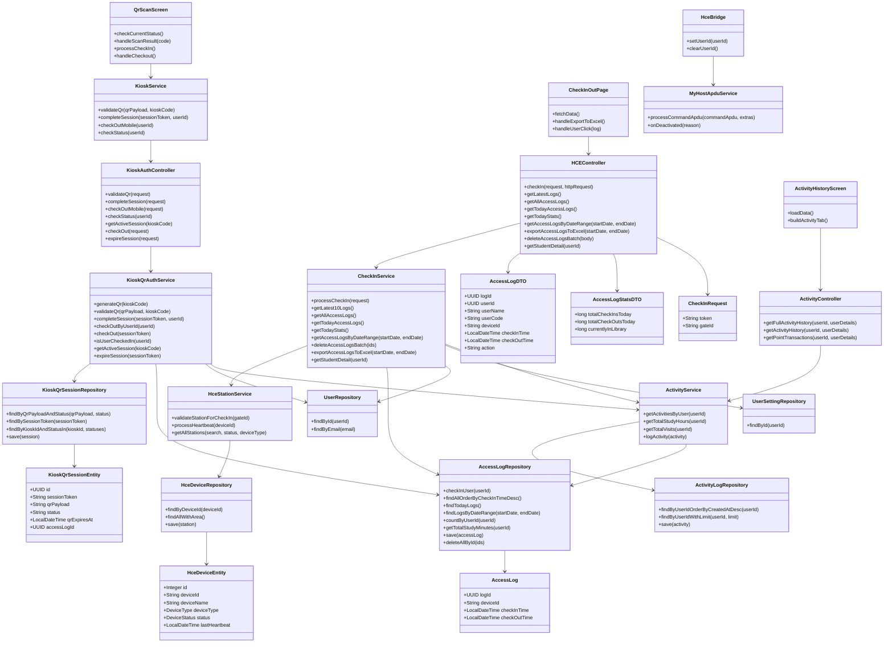

# Library Access Module Class Diagram

```mermaid
classDiagram
    class HCEController {
        +checkIn(request, httpRequest)
        +getLatestLogs()
        +getAllAccessLogs()
        +getTodayAccessLogs()
        +getTodayStats()
        +getAccessLogsByDateRange(startDate, endDate)
        +exportAccessLogsToExcel(startDate, endDate)
        +deleteAccessLogsBatch(body)
        +getStudentDetail(userId)
    }

    class CheckInService {
        +processCheckIn(request)
        +getLatest10Logs()
        +getAllAccessLogs()
        +getTodayAccessLogs()
        +getTodayStats()
        +getAccessLogsByDateRange(startDate, endDate)
        +deleteAccessLogsBatch(ids)
        +exportAccessLogsToExcel(startDate, endDate)
        +getStudentDetail(userId)
    }

    class HceStationService {
        +validateStationForCheckIn(gateId)
        +processHeartbeat(deviceId)
        +getAllStations(search, status, deviceType)
    }

    class KioskAuthController {
        +validateQr(request)
        +completeSession(request)
        +checkOutMobile(request)
        +checkStatus(userId)
        +getActiveSession(kioskCode)
        +checkOut(request)
        +expireSession(request)
    }

    class KioskQrAuthService {
        +generateQr(kioskCode)
        +validateQr(qrPayload, kioskCode)
        +completeSession(sessionToken, userId)
        +checkOutByUserId(userId)
        +checkOut(sessionToken)
        +isUserCheckedIn(userId)
        +getActiveSession(kioskCode)
        +expireSession(sessionToken)
    }

    class ActivityController {
        +getFullActivityHistory(userId, userDetails)
        +getActivityHistory(userId, userDetails)
        +getPointTransactions(userId, userDetails)
    }

    class ActivityService {
        +getActivitiesByUser(userId)
        +getTotalStudyHours(userId)
        +getTotalVisits(userId)
        +logActivity(activity)
    }

    class KioskService {
        +validateQr(qrPayload, kioskCode)
        +completeSession(sessionToken, userId)
        +checkOutMobile(userId)
        +checkStatus(userId)
    }

    class QrScanScreen {
        +checkCurrentStatus()
        +handleScanResult(code)
        +processCheckIn()
        +handleCheckout()
    }

    class ActivityHistoryScreen {
        +loadData()
        +buildActivityTab()
    }

    class CheckInOutPage {
        +fetchData()
        +handleExportToExcel()
        +handleUserClick(log)
    }

    class HceBridge {
        +setUserId(userId)
        +clearUserId()
    }

    class MyHostApduService {
        +processCommandApdu(commandApdu, extras)
        +onDeactivated(reason)
    }

    class AccessLogRepository {
        +checkInUser(userId)
        +findAllOrderByCheckInTimeDesc()
        +findTodayLogs()
        +findLogsByDateRange(startDate, endDate)
        +countByUserId(userId)
        +getTotalStudyMinutes(userId)
        +save(accessLog)
        +deleteAllById(ids)
    }

    class UserRepository {
        +findById(userId)
        +findByEmail(email)
    }

    class UserSettingRepository {
        +findById(userId)
    }

    class ActivityLogRepository {
        +findByUserIdOrderByCreatedAtDesc(userId)
        +findByUserIdWithLimit(userId, limit)
        +save(activity)
    }

    class KioskQrSessionRepository {
        +findByQrPayloadAndStatus(qrPayload, status)
        +findBySessionToken(sessionToken)
        +findByKioskIdAndStatusIn(kioskId, statuses)
        +save(session)
    }

    class HceDeviceRepository {
        +findByDeviceId(deviceId)
        +findAllWithArea()
        +save(station)
    }

    class AccessLog {
        +UUID logId
        +String deviceId
        +LocalDateTime checkInTime
        +LocalDateTime checkOutTime
    }

    class HceDeviceEntity {
        +Integer id
        +String deviceId
        +String deviceName
        +DeviceType deviceType
        +DeviceStatus status
        +LocalDateTime lastHeartbeat
    }

    class KioskQrSessionEntity {
        +UUID id
        +String sessionToken
        +String qrPayload
        +String status
        +LocalDateTime qrExpiresAt
        +UUID accessLogId
    }

    class AccessLogDTO {
        +UUID logId
        +UUID userId
        +String userName
        +String userCode
        +String deviceId
        +LocalDateTime checkInTime
        +LocalDateTime checkOutTime
        +String action
    }

    class AccessLogStatsDTO {
        +long totalCheckInsToday
        +long totalCheckOutsToday
        +long currentlyInLibrary
    }

    class CheckInRequest {
        +String token
        +String gateId
    }

    HCEController --> CheckInService
    CheckInService --> HceStationService
    CheckInService --> AccessLogRepository
    CheckInService --> UserRepository
    CheckInService --> UserSettingRepository
    CheckInService --> ActivityService
    HceStationService --> HceDeviceRepository
    KioskAuthController --> KioskQrAuthService
    KioskQrAuthService --> KioskQrSessionRepository
    KioskQrAuthService --> AccessLogRepository
    KioskQrAuthService --> UserRepository
    KioskQrAuthService --> ActivityService
    ActivityController --> ActivityService
    ActivityService --> ActivityLogRepository
    ActivityService --> AccessLogRepository
    KioskService --> KioskAuthController
    QrScanScreen --> KioskService
    ActivityHistoryScreen --> ActivityController
    CheckInOutPage --> HCEController
    HceBridge --> MyHostApduService
    AccessLogRepository --> AccessLog
    HceDeviceRepository --> HceDeviceEntity
    KioskQrSessionRepository --> KioskQrSessionEntity
    HCEController --> AccessLogDTO
    HCEController --> AccessLogStatsDTO
    HCEController --> CheckInRequest
```
