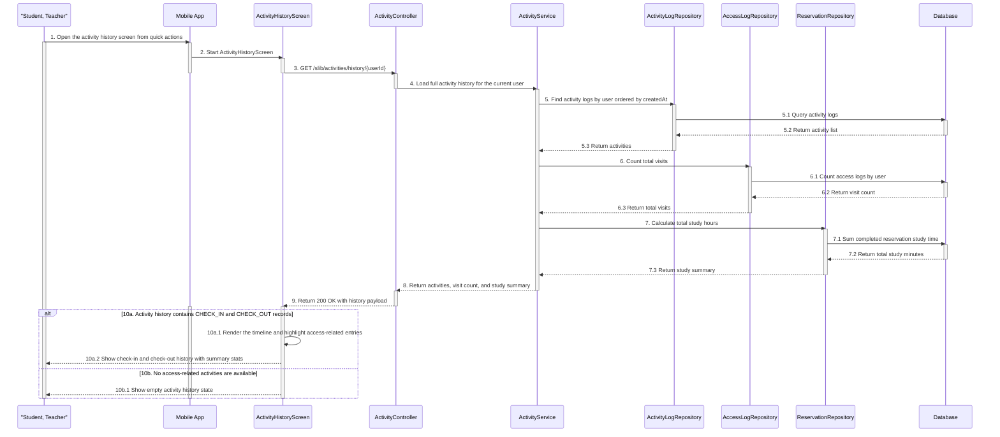

# FE-74 View History of Check-Ins/Check-Outs

```mermaid
sequenceDiagram
    participant Users as "Student, Teacher"
    participant MobileApp as Mobile App
    participant ActivityScreen as ActivityHistoryScreen
    participant ActivityController as ActivityController
    participant ActivityService as ActivityService
    participant ActivityLogRepo as ActivityLogRepository
    participant AccessLogRepo as AccessLogRepository
    participant ReservationRepo as ReservationRepository
    participant DB as Database

    Users->>MobileApp: 1. Open the activity history screen from quick actions
    activate Users
    activate MobileApp
    MobileApp->>ActivityScreen: 2. Start ActivityHistoryScreen
    activate ActivityScreen
    ActivityScreen->>ActivityController: 3. GET /slib/activities/history/{userId}
    deactivate ActivityScreen
    deactivate MobileApp
    activate ActivityController
    ActivityController->>ActivityService: 4. Load full activity history for the current user
    deactivate ActivityController
    activate ActivityService
    ActivityService->>ActivityLogRepo: 5. Find activity logs by user ordered by createdAt
    activate ActivityLogRepo
    ActivityLogRepo->>DB: 5.1 Query activity logs
    activate DB
    DB-->>ActivityLogRepo: 5.2 Return activity list
    deactivate DB
    ActivityLogRepo-->>ActivityService: 5.3 Return activities
    deactivate ActivityLogRepo
    ActivityService->>AccessLogRepo: 6. Count total visits
    activate AccessLogRepo
    AccessLogRepo->>DB: 6.1 Count access logs by user
    activate DB
    DB-->>AccessLogRepo: 6.2 Return visit count
    deactivate DB
    AccessLogRepo-->>ActivityService: 6.3 Return total visits
    deactivate AccessLogRepo
    ActivityService->>ReservationRepo: 7. Calculate total study hours
    activate ReservationRepo
    ReservationRepo->>DB: 7.1 Sum completed reservation study time
    activate DB
    DB-->>ReservationRepo: 7.2 Return total study minutes
    deactivate DB
    ReservationRepo-->>ActivityService: 7.3 Return study summary
    deactivate ReservationRepo
    ActivityService-->>ActivityController: 8. Return activities, visit count, and study summary
    deactivate ActivityService
    activate ActivityController
    ActivityController-->>ActivityScreen: 9. Return 200 OK with history payload
    deactivate ActivityController
    activate ActivityScreen
    activate MobileApp

    alt 10a. Activity history contains CHECK_IN and CHECK_OUT records
        ActivityScreen->>ActivityScreen: 10a.1 Render the timeline and highlight access-related entries
        ActivityScreen-->>Users: 10a.2 Show check-in and check-out history with summary stats
    else 10b. No access-related activities are available
        ActivityScreen-->>Users: 10b.1 Show empty activity history state
    end

    deactivate ActivityScreen
    deactivate MobileApp
    deactivate Users
```
