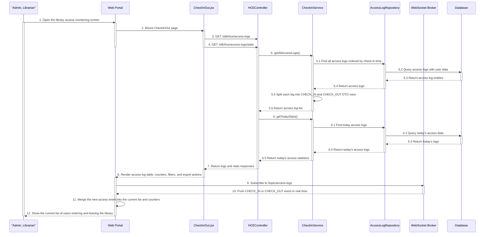

# FE-79 View List of Users Access to Library

```mermaid
sequenceDiagram
    participant Users as "Admin, Librarian"
    participant Client as Web Portal
    participant AccessPage as CheckInOut.jsx
    participant HCEController as HCEController
    participant CheckInService as CheckInService
    participant AccessLogRepo as AccessLogRepository
    participant Broker as WebSocket Broker
    participant DB as Database

    Users->>Client: 1. Open the library access monitoring screen
    activate Users
    activate Client
    Client->>AccessPage: 2. Mount CheckInOut page
    activate AccessPage
    AccessPage->>HCEController: 3. GET /slib/hce/access-logs
    AccessPage->>HCEController: 4. GET /slib/hce/access-logs/stats
    deactivate AccessPage
    deactivate Client
    activate HCEController
    HCEController->>CheckInService: 5. getAllAccessLogs()
    activate CheckInService
    CheckInService->>AccessLogRepo: 5.1 Find all access logs ordered by check-in time
    activate AccessLogRepo
    AccessLogRepo->>DB: 5.2 Query access logs with user data
    activate DB
    DB-->>AccessLogRepo: 5.3 Return access log entities
    deactivate DB
    AccessLogRepo-->>CheckInService: 5.4 Return access logs
    deactivate AccessLogRepo
    CheckInService->>CheckInService: 5.5 Split each log into CHECK_IN and CHECK_OUT DTO rows
    CheckInService-->>HCEController: 5.6 Return access log list
    deactivate CheckInService
    HCEController->>CheckInService: 6. getTodayStats()
    activate CheckInService
    CheckInService->>AccessLogRepo: 6.1 Find today access logs
    activate AccessLogRepo
    AccessLogRepo->>DB: 6.2 Query today's access data
    activate DB
    DB-->>AccessLogRepo: 6.3 Return today's logs
    deactivate DB
    AccessLogRepo-->>CheckInService: 6.4 Return today's access logs
    deactivate AccessLogRepo
    CheckInService-->>HCEController: 6.5 Return today's access statistics
    deactivate CheckInService
    HCEController-->>AccessPage: 7. Return logs and stats responses
    deactivate HCEController
    activate AccessPage
    AccessPage-->>Client: 8. Render access log table, counters, filters, and export actions
    deactivate AccessPage
    activate Client
    Client->>Broker: 9. Subscribe to /topic/access-logs
    activate Broker
    Broker-->>Client: 10. Push CHECK_IN or CHECK_OUT event in real time
    deactivate Broker
    Client->>Client: 11. Merge the new access event into the current list and counters
    Client-->>Users: 12. Show the current list of users entering and leaving the library
    deactivate Client
    deactivate Users
```

