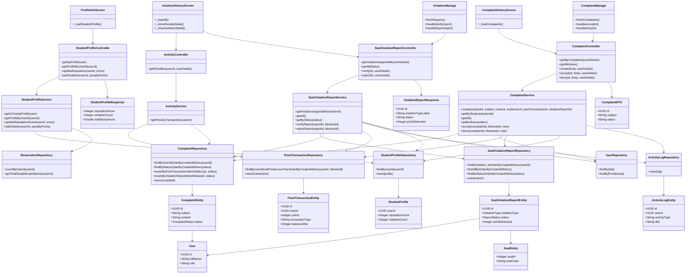

# Reputation and Violation Module Class Diagram

```mermaid
classDiagram
    class StudentProfileController {
        +getMyProfile(user)
        +getProfileByUserId(userId)
        +updateReputation(userId, score)
        +addViolation(userId, penaltyPoints)
    }

    class ActivityController {
        +getPenalties(userId, userDetails)
    }

    class SeatViolationReportController {
        +getViolationsAgainstMe(userDetails)
        +getAll(status)
        +verify(id, userDetails)
        +reject(id, userDetails)
    }

    class ComplaintController {
        +getMyComplaints(userDetails)
        +getAll(status)
        +create(body, userDetails)
        +accept(id, body, userDetails)
        +deny(id, body, userDetails)
    }

    class StudentProfileService {
        +getOrCreateProfile(user)
        +getProfileByUserId(userId)
        +updateReputationScore(userId, score)
        +addViolation(userId, penaltyPoints)
    }

    class ActivityService {
        +getPenaltyTransactions(userId)
    }

    class SeatViolationReportService {
        +getViolationsAgainstMe(violatorId)
        +getAll()
        +getByStatus(status)
        +verifyReport(reportId, librarianId)
        +rejectReport(reportId, librarianId)
    }

    class ComplaintService {
        +create(studentId, subject, content, evidenceUrl, pointTransactionId, violationReportId)
        +getByStudent(studentId)
        +getAll()
        +getByStatus(status)
        +accept(complaintId, librarianId, note)
        +deny(complaintId, librarianId, note)
    }

    class StudentProfileRepository {
        +findByUserId(userId)
        +save(profile)
    }

    class PointTransactionRepository {
        +findByUserIdAndPointsLessThanOrderByCreatedAtDesc(userId, threshold)
        +save(transaction)
    }

    class ComplaintRepository {
        +findByUserIdOrderByCreatedAtDesc(userId)
        +findByStatusOrderByCreatedAtDesc(status)
        +existsByPointTransactionIdAndStatus(id, status)
        +existsByViolationReportIdAndStatus(id, status)
        +save(complaint)
    }

    class SeatViolationReportRepository {
        +findByViolator_IdOrderByCreatedAtDesc(userId)
        +findAllByOrderByCreatedAtDesc()
        +findByStatusOrderByCreatedAtDesc(status)
        +save(report)
    }

    class ActivityLogRepository {
        +save(log)
    }

    class UserRepository {
        +findById(id)
        +findByEmail(email)
    }

    class ReservationRepository {
        +countByUserId(userId)
        +getTotalStudyMinutesByUser(userId)
    }

    class StudentProfile {
        +UUID userId
        +Integer reputationScore
        +Integer violationCount
    }

    class PointTransactionEntity {
        +UUID id
        +UUID userId
        +Integer points
        +String transactionType
        +Integer balanceAfter
    }

    class ActivityLogEntity {
        +UUID id
        +UUID userId
        +String activityType
        +String title
    }

    class SeatViolationReportEntity {
        +UUID id
        +ViolationType violationType
        +ReportStatus status
        +Integer pointDeducted
    }

    class ComplaintEntity {
        +UUID id
        +String subject
        +String content
        +ComplaintStatus status
    }

    class User {
        +UUID id
        +String fullName
        +String role
    }

    class SeatEntity {
        +Integer seatId
        +String seatCode
    }

    class StudentProfileResponse {
        +Integer reputationScore
        +Integer violationCount
        +Double totalStudyHours
    }

    class ViolationReportResponse {
        +UUID id
        +String violationTypeLabel
        +String status
        +Integer pointDeducted
    }

    class ComplaintDTO {
        +UUID id
        +String subject
        +String status
    }

    class ProfileInfoScreen {
        +_loadStudentProfile()
    }

    class ViolationHistoryScreen {
        +_loadAll()
        +_showPenaltyDetail()
        +_showViolationDetail()
    }

    class ComplaintHistoryScreen {
        +_loadComplaints()
    }

    class ViolationManage {
        +fetchReports()
        +handleVerify(report)
        +handleReject(report)
    }

    class ComplaintManage {
        +fetchComplaints()
        +handleAccept(id)
        +handleDeny(id)
    }

    StudentProfileController --> StudentProfileService
    ActivityController --> ActivityService
    SeatViolationReportController --> SeatViolationReportService
    ComplaintController --> ComplaintService

    StudentProfileService --> StudentProfileRepository
    StudentProfileService --> ReservationRepository
    ActivityService --> PointTransactionRepository
    ActivityService --> ComplaintRepository
    SeatViolationReportService --> SeatViolationReportRepository
    SeatViolationReportService --> ComplaintRepository
    SeatViolationReportService --> PointTransactionRepository
    SeatViolationReportService --> ActivityLogRepository
    SeatViolationReportService --> StudentProfileRepository
    SeatViolationReportService --> UserRepository
    ComplaintService --> ComplaintRepository
    ComplaintService --> UserRepository
    ComplaintService --> PointTransactionRepository
    ComplaintService --> SeatViolationReportRepository
    ComplaintService --> StudentProfileRepository
    ComplaintService --> ActivityLogRepository

    StudentProfileRepository --> StudentProfile
    SeatViolationReportRepository --> SeatViolationReportEntity
    ComplaintRepository --> ComplaintEntity
    PointTransactionRepository --> PointTransactionEntity
    ActivityLogRepository --> ActivityLogEntity

    SeatViolationReportEntity --> User
    SeatViolationReportEntity --> SeatEntity
    ComplaintEntity --> User

    StudentProfileController --> StudentProfileResponse
    SeatViolationReportController --> ViolationReportResponse
    ComplaintController --> ComplaintDTO

    ProfileInfoScreen --> StudentProfileController
    ViolationHistoryScreen --> ActivityController
    ViolationHistoryScreen --> SeatViolationReportController
    ComplaintHistoryScreen --> ComplaintController
    ViolationManage --> SeatViolationReportController
    ComplaintManage --> ComplaintController
```
