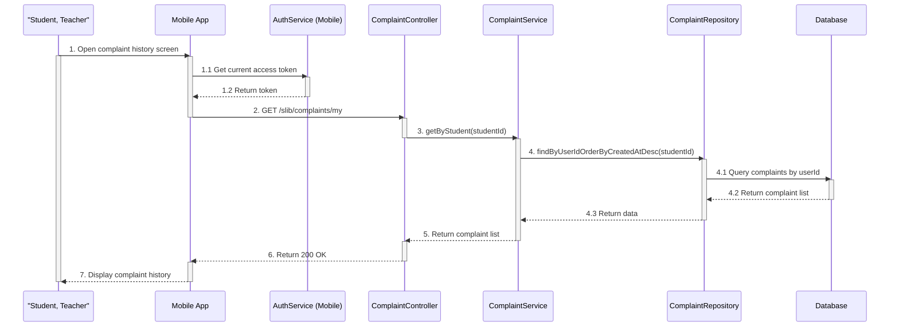

# FE-82 View History of Sending Complaint

```mermaid
sequenceDiagram
    participant Users as "Student, Teacher"
    participant MobileApp as Mobile App
    participant AuthService as AuthService (Mobile)
    participant ComplaintController as ComplaintController
    participant ComplaintService as ComplaintService
    participant ComplaintRepo as ComplaintRepository
    participant DB as Database

    Users->>MobileApp: 1. Open complaint history screen
    activate Users
    activate MobileApp
    MobileApp->>AuthService: 1.1 Get current access token
    activate AuthService
    AuthService-->>MobileApp: 1.2 Return token
    deactivate AuthService
    MobileApp->>ComplaintController: 2. GET /slib/complaints/my
    deactivate MobileApp
    activate ComplaintController
    ComplaintController->>ComplaintService: 3. getByStudent(studentId)
    deactivate ComplaintController
    activate ComplaintService
    ComplaintService->>ComplaintRepo: 4. findByUserIdOrderByCreatedAtDesc(studentId)
    activate ComplaintRepo
    ComplaintRepo->>DB: 4.1 Query complaints by userId
    activate DB
    DB-->>ComplaintRepo: 4.2 Return complaint list
    deactivate DB
    ComplaintRepo-->>ComplaintService: 4.3 Return data
    deactivate ComplaintRepo
    ComplaintService-->>ComplaintController: 5. Return complaint list
    deactivate ComplaintService
    activate ComplaintController
    ComplaintController-->>MobileApp: 6. Return 200 OK
    deactivate ComplaintController
    activate MobileApp
    MobileApp-->>Users: 7. Display complaint history
    deactivate MobileApp
    deactivate Users
```
