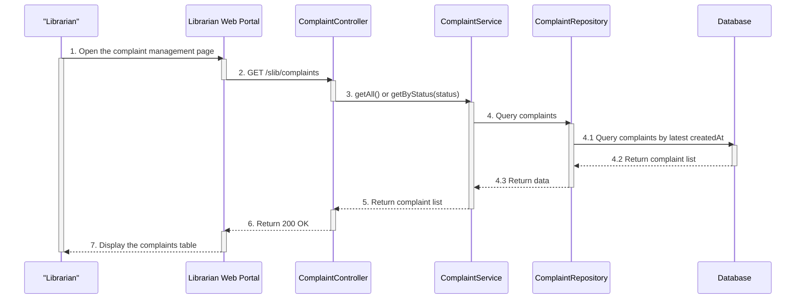

# FE-83 View List of Complaints

```mermaid
sequenceDiagram
    participant Users as "Librarian"
    participant WebPortal as Librarian Web Portal
    participant ComplaintController as ComplaintController
    participant ComplaintService as ComplaintService
    participant ComplaintRepo as ComplaintRepository
    participant DB as Database

    Users->>WebPortal: 1. Open the complaint management page
    activate Users
    activate WebPortal
    WebPortal->>ComplaintController: 2. GET /slib/complaints
    deactivate WebPortal
    activate ComplaintController
    ComplaintController->>ComplaintService: 3. getAll() or getByStatus(status)
    deactivate ComplaintController
    activate ComplaintService
    ComplaintService->>ComplaintRepo: 4. Query complaints
    activate ComplaintRepo
    ComplaintRepo->>DB: 4.1 Query complaints by latest createdAt
    activate DB
    DB-->>ComplaintRepo: 4.2 Return complaint list
    deactivate DB
    ComplaintRepo-->>ComplaintService: 4.3 Return data
    deactivate ComplaintRepo
    ComplaintService-->>ComplaintController: 5. Return complaint list
    deactivate ComplaintService
    activate ComplaintController
    ComplaintController-->>WebPortal: 6. Return 200 OK
    deactivate ComplaintController
    activate WebPortal
    WebPortal-->>Users: 7. Display the complaints table
    deactivate WebPortal
    deactivate Users
```
