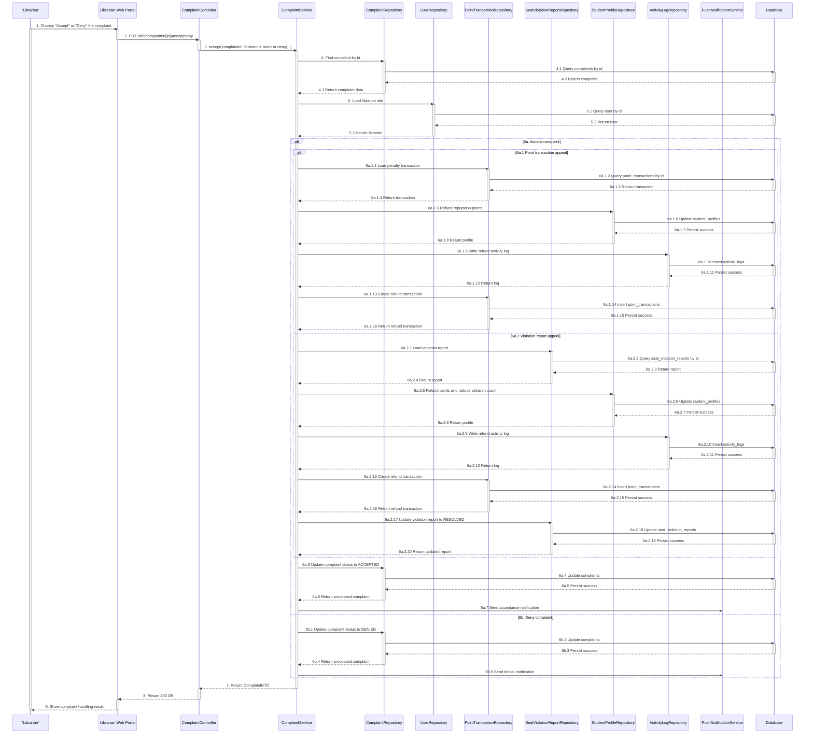

# FE-89 Verify Complaint

```mermaid
sequenceDiagram
    participant Users as "Librarian"
    participant WebPortal as Librarian Web Portal
    participant ComplaintController as ComplaintController
    participant ComplaintService as ComplaintService
    participant ComplaintRepo as ComplaintRepository
    participant UserRepo as UserRepository
    participant PointRepo as PointTransactionRepository
    participant ViolationRepo as SeatViolationReportRepository
    participant StudentProfileRepo as StudentProfileRepository
    participant ActivityLogRepo as ActivityLogRepository
    participant PushService as PushNotificationService
    participant DB as Database

    Users->>WebPortal: 1. Choose "Accept" or "Deny" the complaint
    activate Users
    activate WebPortal
    WebPortal->>ComplaintController: 2. PUT /slib/complaints/{id}/accept|deny
    deactivate WebPortal
    activate ComplaintController
    ComplaintController->>ComplaintService: 3. accept(complaintId, librarianId, note) or deny(...)
    deactivate ComplaintController
    activate ComplaintService
    ComplaintService->>ComplaintRepo: 4. Find complaint by id
    activate ComplaintRepo
    ComplaintRepo->>DB: 4.1 Query complaints by id
    activate DB
    DB-->>ComplaintRepo: 4.2 Return complaint
    deactivate DB
    ComplaintRepo-->>ComplaintService: 4.3 Return complaint data
    deactivate ComplaintRepo
    ComplaintService->>UserRepo: 5. Load librarian info
    activate UserRepo
    UserRepo->>DB: 5.1 Query user by id
    activate DB
    DB-->>UserRepo: 5.2 Return user
    deactivate DB
    UserRepo-->>ComplaintService: 5.3 Return librarian
    deactivate UserRepo

    alt 6a. Accept complaint
        alt 6a.1 Point transaction appeal
            ComplaintService->>PointRepo: 6a.1.1 Load penalty transaction
            activate PointRepo
            PointRepo->>DB: 6a.1.2 Query point_transactions by id
            activate DB
            DB-->>PointRepo: 6a.1.3 Return transaction
            deactivate DB
            PointRepo-->>ComplaintService: 6a.1.4 Return transaction
            deactivate PointRepo
            ComplaintService->>StudentProfileRepo: 6a.1.5 Refund reputation points
            activate StudentProfileRepo
            StudentProfileRepo->>DB: 6a.1.6 Update student_profiles
            activate DB
            DB-->>StudentProfileRepo: 6a.1.7 Persist success
            deactivate DB
            StudentProfileRepo-->>ComplaintService: 6a.1.8 Return profile
            deactivate StudentProfileRepo
            ComplaintService->>ActivityLogRepo: 6a.1.9 Write refund activity log
            activate ActivityLogRepo
            ActivityLogRepo->>DB: 6a.1.10 Insert activity_logs
            activate DB
            DB-->>ActivityLogRepo: 6a.1.11 Persist success
            deactivate DB
            ActivityLogRepo-->>ComplaintService: 6a.1.12 Return log
            deactivate ActivityLogRepo
            ComplaintService->>PointRepo: 6a.1.13 Create refund transaction
            activate PointRepo
            PointRepo->>DB: 6a.1.14 Insert point_transactions
            activate DB
            DB-->>PointRepo: 6a.1.15 Persist success
            deactivate DB
            PointRepo-->>ComplaintService: 6a.1.16 Return refund transaction
            deactivate PointRepo
        else 6a.2 Violation report appeal
            ComplaintService->>ViolationRepo: 6a.2.1 Load violation report
            activate ViolationRepo
            ViolationRepo->>DB: 6a.2.2 Query seat_violation_reports by id
            activate DB
            DB-->>ViolationRepo: 6a.2.3 Return report
            deactivate DB
            ViolationRepo-->>ComplaintService: 6a.2.4 Return report
            deactivate ViolationRepo
            ComplaintService->>StudentProfileRepo: 6a.2.5 Refund points and reduce violation count
            activate StudentProfileRepo
            StudentProfileRepo->>DB: 6a.2.6 Update student_profiles
            activate DB
            DB-->>StudentProfileRepo: 6a.2.7 Persist success
            deactivate DB
            StudentProfileRepo-->>ComplaintService: 6a.2.8 Return profile
            deactivate StudentProfileRepo
            ComplaintService->>ActivityLogRepo: 6a.2.9 Write refund activity log
            activate ActivityLogRepo
            ActivityLogRepo->>DB: 6a.2.10 Insert activity_logs
            activate DB
            DB-->>ActivityLogRepo: 6a.2.11 Persist success
            deactivate DB
            ActivityLogRepo-->>ComplaintService: 6a.2.12 Return log
            deactivate ActivityLogRepo
            ComplaintService->>PointRepo: 6a.2.13 Create refund transaction
            activate PointRepo
            PointRepo->>DB: 6a.2.14 Insert point_transactions
            activate DB
            DB-->>PointRepo: 6a.2.15 Persist success
            deactivate DB
            PointRepo-->>ComplaintService: 6a.2.16 Return refund transaction
            deactivate PointRepo
            ComplaintService->>ViolationRepo: 6a.2.17 Update violation report to RESOLVED
            activate ViolationRepo
            ViolationRepo->>DB: 6a.2.18 Update seat_violation_reports
            activate DB
            DB-->>ViolationRepo: 6a.2.19 Persist success
            deactivate DB
            ViolationRepo-->>ComplaintService: 6a.2.20 Return updated report
            deactivate ViolationRepo
        end

        ComplaintService->>ComplaintRepo: 6a.3 Update complaint status to ACCEPTED
        activate ComplaintRepo
        ComplaintRepo->>DB: 6a.4 Update complaints
        activate DB
        DB-->>ComplaintRepo: 6a.5 Persist success
        deactivate DB
        ComplaintRepo-->>ComplaintService: 6a.6 Return processed complaint
        deactivate ComplaintRepo
        ComplaintService->>PushService: 6a.7 Send acceptance notification
    else 6b. Deny complaint
        ComplaintService->>ComplaintRepo: 6b.1 Update complaint status to DENIED
        activate ComplaintRepo
        ComplaintRepo->>DB: 6b.2 Update complaints
        activate DB
        DB-->>ComplaintRepo: 6b.3 Persist success
        deactivate DB
        ComplaintRepo-->>ComplaintService: 6b.4 Return processed complaint
        deactivate ComplaintRepo
        ComplaintService->>PushService: 6b.5 Send denial notification
    end

    ComplaintService-->>ComplaintController: 7. Return ComplaintDTO
    deactivate ComplaintService
    activate ComplaintController
    ComplaintController-->>WebPortal: 8. Return 200 OK
    deactivate ComplaintController
    activate WebPortal
    WebPortal-->>Users: 9. Show complaint handling result
    deactivate WebPortal
    deactivate Users
```

