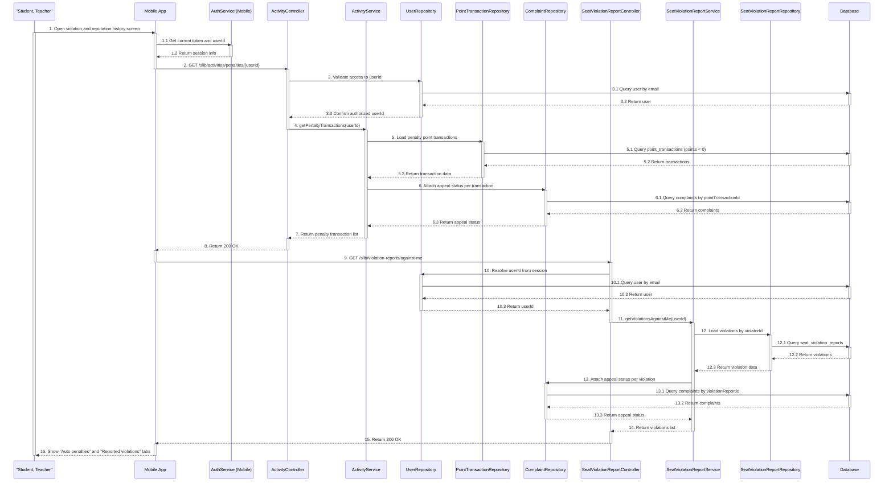

# FE-77 View History of Changed Reputation Points

```mermaid
sequenceDiagram
    participant Users as "Student, Teacher"
    participant MobileApp as Mobile App
    participant AuthService as AuthService (Mobile)
    participant ActivityController as ActivityController
    participant ActivityService as ActivityService
    participant UserRepo as UserRepository
    participant PointRepo as PointTransactionRepository
    participant ComplaintRepo as ComplaintRepository
    participant ViolationController as SeatViolationReportController
    participant ViolationService as SeatViolationReportService
    participant ViolationRepo as SeatViolationReportRepository
    participant DB as Database

    Users->>MobileApp: 1. Open violation and reputation history screen
    activate Users
    activate MobileApp
    MobileApp->>AuthService: 1.1 Get current token and userId
    activate AuthService
    AuthService-->>MobileApp: 1.2 Return session info
    deactivate AuthService

    MobileApp->>ActivityController: 2. GET /slib/activities/penalties/{userId}
    deactivate MobileApp
    activate ActivityController
    ActivityController->>UserRepo: 3. Validate access to userId
    activate UserRepo
    UserRepo->>DB: 3.1 Query user by email
    activate DB
    DB-->>UserRepo: 3.2 Return user
    deactivate DB
    UserRepo-->>ActivityController: 3.3 Confirm authorized userId
    deactivate UserRepo
    ActivityController->>ActivityService: 4. getPenaltyTransactions(userId)
    deactivate ActivityController
    activate ActivityService
    ActivityService->>PointRepo: 5. Load penalty point transactions
    activate PointRepo
    PointRepo->>DB: 5.1 Query point_transactions (points < 0)
    activate DB
    DB-->>PointRepo: 5.2 Return transactions
    deactivate DB
    PointRepo-->>ActivityService: 5.3 Return transaction data
    deactivate PointRepo
    ActivityService->>ComplaintRepo: 6. Attach appeal status per transaction
    activate ComplaintRepo
    ComplaintRepo->>DB: 6.1 Query complaints by pointTransactionId
    activate DB
    DB-->>ComplaintRepo: 6.2 Return complaints
    deactivate DB
    ComplaintRepo-->>ActivityService: 6.3 Return appeal status
    deactivate ComplaintRepo
    ActivityService-->>ActivityController: 7. Return penalty transaction list
    deactivate ActivityService
    activate ActivityController
    ActivityController-->>MobileApp: 8. Return 200 OK
    deactivate ActivityController

    activate MobileApp
    MobileApp->>ViolationController: 9. GET /slib/violation-reports/against-me
    deactivate MobileApp
    activate ViolationController
    ViolationController->>UserRepo: 10. Resolve userId from session
    activate UserRepo
    UserRepo->>DB: 10.1 Query user by email
    activate DB
    DB-->>UserRepo: 10.2 Return user
    deactivate DB
    UserRepo-->>ViolationController: 10.3 Return userId
    deactivate UserRepo
    ViolationController->>ViolationService: 11. getViolationsAgainstMe(userId)
    deactivate ViolationController
    activate ViolationService
    ViolationService->>ViolationRepo: 12. Load violations by violatorId
    activate ViolationRepo
    ViolationRepo->>DB: 12.1 Query seat_violation_reports
    activate DB
    DB-->>ViolationRepo: 12.2 Return violations
    deactivate DB
    ViolationRepo-->>ViolationService: 12.3 Return violation data
    deactivate ViolationRepo
    ViolationService->>ComplaintRepo: 13. Attach appeal status per violation
    activate ComplaintRepo
    ComplaintRepo->>DB: 13.1 Query complaints by violationReportId
    activate DB
    DB-->>ComplaintRepo: 13.2 Return complaints
    deactivate DB
    ComplaintRepo-->>ViolationService: 13.3 Return appeal status
    deactivate ComplaintRepo
    ViolationService-->>ViolationController: 14. Return violations list
    deactivate ViolationService
    activate ViolationController
    ViolationController-->>MobileApp: 15. Return 200 OK
    deactivate ViolationController
    activate MobileApp

    MobileApp-->>Users: 16. Show "Auto penalties" and "Reported violations" tabs
    deactivate MobileApp
    deactivate Users
```
