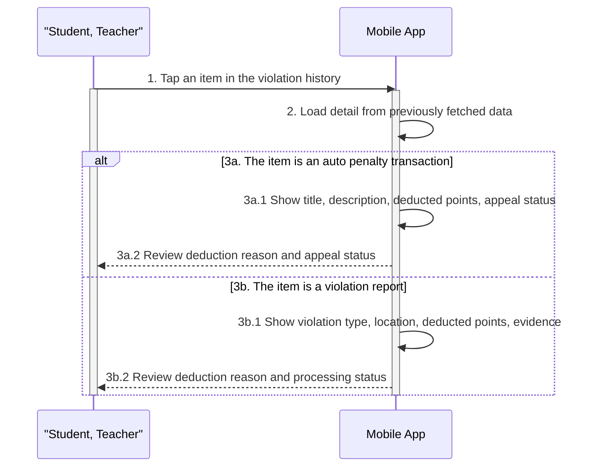

# FE-78 View Detailed Reason for Deducting Points

```mermaid
sequenceDiagram
    participant Users as "Student, Teacher"
    participant MobileApp as Mobile App

    Users->>MobileApp: 1. Tap an item in the violation history
    activate Users
    activate MobileApp
    MobileApp->>MobileApp: 2. Load detail from previously fetched data

    alt 3a. The item is an auto penalty transaction
        MobileApp->>MobileApp: 3a.1 Show title, description, deducted points, appeal status
        MobileApp-->>Users: 3a.2 Review deduction reason and appeal status
    else 3b. The item is a violation report
        MobileApp->>MobileApp: 3b.1 Show violation type, location, deducted points, evidence
        MobileApp-->>Users: 3b.2 Review deduction reason and processing status
    end

    deactivate MobileApp
    deactivate Users
```
