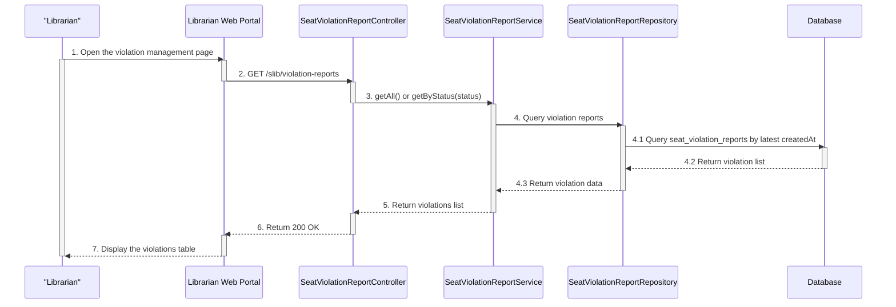

# FE-79 View List of Users Violation

```mermaid
sequenceDiagram
    participant Users as "Librarian"
    participant WebPortal as Librarian Web Portal
    participant ViolationController as SeatViolationReportController
    participant ViolationService as SeatViolationReportService
    participant ViolationRepo as SeatViolationReportRepository
    participant DB as Database

    Users->>WebPortal: 1. Open the violation management page
    activate Users
    activate WebPortal
    WebPortal->>ViolationController: 2. GET /slib/violation-reports
    deactivate WebPortal
    activate ViolationController
    ViolationController->>ViolationService: 3. getAll() or getByStatus(status)
    deactivate ViolationController
    activate ViolationService
    ViolationService->>ViolationRepo: 4. Query violation reports
    activate ViolationRepo
    ViolationRepo->>DB: 4.1 Query seat_violation_reports by latest createdAt
    activate DB
    DB-->>ViolationRepo: 4.2 Return violation list
    deactivate DB
    ViolationRepo-->>ViolationService: 4.3 Return violation data
    deactivate ViolationRepo
    ViolationService-->>ViolationController: 5. Return violations list
    deactivate ViolationService
    activate ViolationController
    ViolationController-->>WebPortal: 6. Return 200 OK
    deactivate ViolationController
    activate WebPortal
    WebPortal-->>Users: 7. Display the violations table
    deactivate WebPortal
    deactivate Users
```
