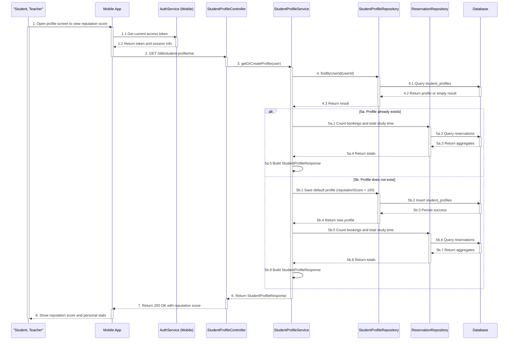

# FE-80 View Reputation Score

```mermaid
sequenceDiagram
    participant Users as "Student, Teacher"
    participant MobileApp as Mobile App
    participant AuthService as AuthService (Mobile)
    participant ProfileController as StudentProfileController
    participant ProfileService as StudentProfileService
    participant ProfileRepo as StudentProfileRepository
    participant ReservationRepo as ReservationRepository
    participant DB as Database

    Users->>MobileApp: 1. Open profile screen to view reputation score
    activate Users
    activate MobileApp
    MobileApp->>AuthService: 1.1 Get current access token
    activate AuthService
    AuthService-->>MobileApp: 1.2 Return token and session info
    deactivate AuthService
    MobileApp->>ProfileController: 2. GET /slib/student-profile/me
    deactivate MobileApp
    activate ProfileController
    ProfileController->>ProfileService: 3. getOrCreateProfile(user)
    deactivate ProfileController
    activate ProfileService
    ProfileService->>ProfileRepo: 4. findByUserId(userId)
    activate ProfileRepo
    ProfileRepo->>DB: 4.1 Query student_profiles
    activate DB
    DB-->>ProfileRepo: 4.2 Return profile or empty result
    deactivate DB
    ProfileRepo-->>ProfileService: 4.3 Return result
    deactivate ProfileRepo

    alt 5a. Profile already exists
        ProfileService->>ReservationRepo: 5a.1 Count bookings and total study time
        activate ReservationRepo
        ReservationRepo->>DB: 5a.2 Query reservations
        activate DB
        DB-->>ReservationRepo: 5a.3 Return aggregates
        deactivate DB
        ReservationRepo-->>ProfileService: 5a.4 Return totals
        deactivate ReservationRepo
        ProfileService->>ProfileService: 5a.5 Build StudentProfileResponse
    else 5b. Profile does not exist
        ProfileService->>ProfileRepo: 5b.1 Save default profile (reputationScore = 100)
        activate ProfileRepo
        ProfileRepo->>DB: 5b.2 Insert student_profiles
        activate DB
        DB-->>ProfileRepo: 5b.3 Persist success
        deactivate DB
        ProfileRepo-->>ProfileService: 5b.4 Return new profile
        deactivate ProfileRepo
        ProfileService->>ReservationRepo: 5b.5 Count bookings and total study time
        activate ReservationRepo
        ReservationRepo->>DB: 5b.6 Query reservations
        activate DB
        DB-->>ReservationRepo: 5b.7 Return aggregates
        deactivate DB
        ReservationRepo-->>ProfileService: 5b.8 Return totals
        deactivate ReservationRepo
        ProfileService->>ProfileService: 5b.9 Build StudentProfileResponse
    end

    ProfileService-->>ProfileController: 6. Return StudentProfileResponse
    deactivate ProfileService
    activate ProfileController
    ProfileController-->>MobileApp: 7. Return 200 OK with reputation score
    deactivate ProfileController
    activate MobileApp
    MobileApp-->>Users: 8. Show reputation score and personal stats
    deactivate MobileApp
    deactivate Users
```

