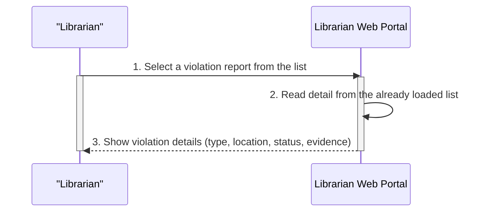

# FE-84 View User Violation Details

```mermaid
sequenceDiagram
    participant Users as "Librarian"
    participant WebPortal as Librarian Web Portal

    Users->>WebPortal: 1. Select a violation report from the list
    activate Users
    activate WebPortal
    WebPortal->>WebPortal: 2. Read detail from the already loaded list
    WebPortal-->>Users: 3. Show violation details (type, location, status, evidence)
    deactivate WebPortal
    deactivate Users
```

