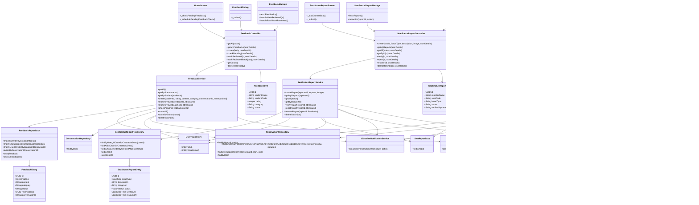

# Feedback Module Class Diagram

```mermaid
classDiagram
    class FeedbackController {
        +getAll(status)
        +getMyFeedbacks(userDetails)
        +create(body, userDetails)
        +checkPending(userDetails)
        +markReviewed(id, userDetails)
        +markReviewedBatch(body, userDetails)
        +getCount()
        +deleteBatch(body)
    }

    class SeatStatusReportController {
        +create(seatId, issueType, description, image, userDetails)
        +getMyReports(userDetails)
        +getAll(status, userDetails)
        +getById(id, userDetails)
        +verify(id, userDetails)
        +reject(id, userDetails)
        +resolve(id, userDetails)
        +deleteBatch(body, userDetails)
    }

    class SeatViolationReportController {
        +create(seatId, violationType, description, images, userDetails)
        +getMyReports(userDetails)
        +getViolationsAgainstMe(userDetails)
        +getAll(status)
        +verify(id, userDetails)
        +reject(id, userDetails)
        +getCount()
        +deleteBatch(body)
    }

    class FeedbackService {
        +getAll()
        +getByStatus(status)
        +getByStudent(studentId)
        +create(studentId, rating, content, category, conversationId, reservationId)
        +markReviewed(feedbackId, librarianId)
        +markReviewedBatch(ids, librarianId)
        +checkPendingFeedback(userId)
        +countAll()
        +countByStatus(status)
        +deleteBatch(ids)
    }

    class SeatStatusReportService {
        +createReport(reporterId, request, image)
        +getMyReports(reporterId)
        +getAll(status)
        +getById(reportId)
        +verifyReport(reportId, librarianId)
        +rejectReport(reportId, librarianId)
        +resolveReport(reportId, librarianId)
        +deleteBatch(ids)
    }

    class SeatViolationReportService {
        +createReport(reporterId, request, images)
        +getMyReports(reporterId)
        +getViolationsAgainstMe(violatorId)
        +getAll()
        +getByStatus(status)
        +verifyReport(reportId, librarianId)
        +rejectReport(reportId, librarianId)
        +countByStatus(status)
        +deleteBatch(ids)
    }

    class FeedbackRepository {
        +findAllByOrderByCreatedAtDesc()
        +findByStatusOrderByCreatedAtDesc(status)
        +findByUserIdOrderByCreatedAtDesc(userId)
        +existsByReservationId(reservationId)
        +save(feedback)
        +saveAll(feedbacks)
    }

    class SeatStatusReportRepository {
        +findByUser_IdOrderByCreatedAtDesc(userId)
        +findAllByOrderByCreatedAtDesc()
        +findByStatusOrderByCreatedAtDesc(status)
        +findById(id)
        +save(report)
    }

    class SeatViolationReportRepository {
        +findByReporter_IdOrderByCreatedAtDesc(userId)
        +findByViolator_IdOrderByCreatedAtDesc(userId)
        +findAllByOrderByCreatedAtDesc()
        +findByStatusOrderByCreatedAtDesc(status)
        +save(report)
    }

    class ReservationRepository {
        +findByUserId(userId)
        +findByUserIdAndConfirmedAtIsNotNullAndEndTimeBeforeAndStatusInOrderByEndTimeDesc(userId, now, statuses)
        +findOverlappingReservations(seatId, start, end)
        +findById(id)
    }

    class UserRepository {
        +findById(id)
        +findByEmail(email)
    }

    class ConversationRepository {
        +findById(id)
    }

    class SeatRepository {
        +findById(id)
    }

    class CloudinaryService {
        +uploadImageChat(file)
    }

    class LibrarianNotificationService {
        +broadcastPendingCounts(module, action)
    }

    class PushNotificationService {
        +sendToUser(userId, title, body, type, entityId)
        +sendToUser(userId, title, body, type, entityId, targetType, targetStatus)
    }

    class SimpMessagingTemplate {
        +convertAndSend(topic, payload)
    }

    class FeedbackEntity {
        +UUID id
        +Integer rating
        +String content
        +String category
        +String status
        +UUID reservationId
        +String conversationId
    }

    class SeatStatusReportEntity {
        +UUID id
        +IssueType issueType
        +String description
        +String imageUrl
        +ReportStatus status
        +LocalDateTime verifiedAt
        +LocalDateTime resolvedAt
    }

    class SeatViolationReportEntity {
        +UUID id
        +ViolationType violationType
        +String description
        +String evidenceUrl
        +ReportStatus status
        +Integer pointDeducted
    }

    class FeedbackDTO {
        +UUID id
        +String studentName
        +String studentCode
        +Integer rating
        +String category
        +String status
    }

    class SeatStatusReportResponse {
        +UUID id
        +String reporterName
        +String seatCode
        +String issueType
        +String status
        +String verifiedByName
    }

    class ViolationReportResponse {
        +UUID id
        +String reporterName
        +String violatorName
        +String seatCode
        +String violationType
        +String status
        +Integer pointDeducted
    }

    class HomeScreen {
        +_checkPendingFeedback()
        +_schedulePendingFeedbackCheck()
    }

    class FeedbackDialog {
        +_submit()
    }

    class FeedbackManage {
        +fetchFeedbacks()
        +handleMarkReviewed(id)
        +handleBatchMarkReviewed()
    }

    class SeatStatusReportScreen {
        +_loadCurrentSeat()
        +_submit()
    }

    class ReportHistoryScreen {
        +_loadReports()
    }

    class SeatStatusReportManage {
        +fetchReports()
        +runAction(reportId, action)
    }

    class ViolationReportScreen {
        +_checkReservation()
        +_submitReport(ctx)
        +_submitSeatStatusReport(ctx)
    }

    class ViolationManage {
        +fetchReports()
        +handleVerify(report)
        +handleReject(report)
    }

    FeedbackController --> FeedbackService
    SeatStatusReportController --> SeatStatusReportService
    SeatViolationReportController --> SeatViolationReportService

    FeedbackService --> FeedbackRepository
    FeedbackService --> ReservationRepository
    FeedbackService --> ConversationRepository
    FeedbackService --> UserRepository
    FeedbackService --> LibrarianNotificationService
    FeedbackService --> SimpMessagingTemplate

    SeatStatusReportService --> SeatStatusReportRepository
    SeatStatusReportService --> UserRepository
    SeatStatusReportService --> SeatRepository
    SeatStatusReportService --> ReservationRepository
    SeatStatusReportService --> CloudinaryService
    SeatStatusReportService --> LibrarianNotificationService
    SeatStatusReportService --> PushNotificationService

    SeatViolationReportService --> SeatViolationReportRepository
    SeatViolationReportService --> UserRepository
    SeatViolationReportService --> SeatRepository
    SeatViolationReportService --> ReservationRepository
    SeatViolationReportService --> CloudinaryService
    SeatViolationReportService --> LibrarianNotificationService
    SeatViolationReportService --> PushNotificationService
    SeatViolationReportService --> SimpMessagingTemplate

    FeedbackRepository --> FeedbackEntity
    SeatStatusReportRepository --> SeatStatusReportEntity
    SeatViolationReportRepository --> SeatViolationReportEntity

    FeedbackController --> FeedbackDTO
    SeatStatusReportController --> SeatStatusReportResponse
    SeatViolationReportController --> ViolationReportResponse

    HomeScreen --> FeedbackController
    FeedbackDialog --> FeedbackController
    FeedbackManage --> FeedbackController
    SeatStatusReportScreen --> SeatStatusReportController
    ReportHistoryScreen --> SeatStatusReportController
    ReportHistoryScreen --> SeatViolationReportController
    SeatStatusReportManage --> SeatStatusReportController
    ViolationReportScreen --> SeatViolationReportController
    ViolationReportScreen --> SeatStatusReportController
    ViolationManage --> SeatViolationReportController
```
