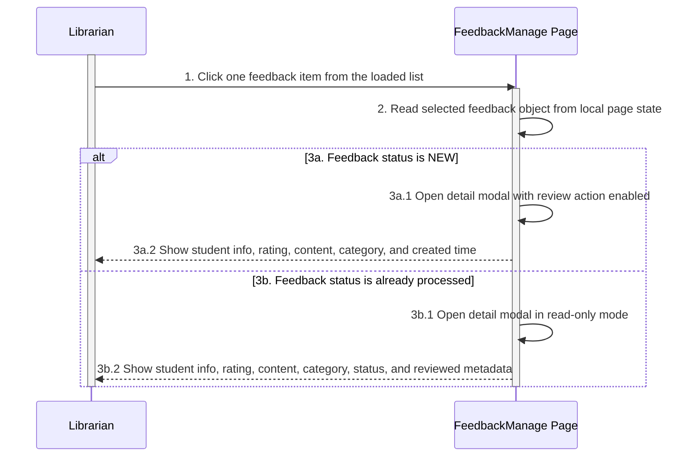

# FE-88 View Feedback Details

```mermaid
sequenceDiagram
    participant Librarian as Librarian
    participant FeedbackManage as FeedbackManage Page

    activate Librarian
    Librarian->>FeedbackManage: 1. Click one feedback item from the loaded list
    activate FeedbackManage
    FeedbackManage->>FeedbackManage: 2. Read selected feedback object from local page state

    alt 3a. Feedback status is NEW
        FeedbackManage->>FeedbackManage: 3a.1 Open detail modal with review action enabled
        FeedbackManage-->>Librarian: 3a.2 Show student info, rating, content, category, and created time
    else 3b. Feedback status is already processed
        FeedbackManage->>FeedbackManage: 3b.1 Open detail modal in read-only mode
        FeedbackManage-->>Librarian: 3b.2 Show student info, rating, content, category, status, and reviewed metadata
    end

    deactivate FeedbackManage
    deactivate Librarian
```
