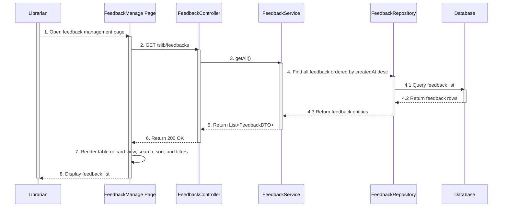

# FE-91 View List of Feedbacks

```mermaid
sequenceDiagram
    participant Librarian as Librarian
    participant FeedbackManage as FeedbackManage Page
    participant FeedbackController as FeedbackController
    participant FeedbackService as FeedbackService
    participant FeedbackRepo as FeedbackRepository
    participant DB as Database

    activate Librarian
    Librarian->>FeedbackManage: 1. Open feedback management page
    activate FeedbackManage
    FeedbackManage->>FeedbackController: 2. GET /slib/feedbacks
    activate FeedbackController
    FeedbackController->>FeedbackService: 3. getAll()
    activate FeedbackService
    FeedbackService->>FeedbackRepo: 4. Find all feedback ordered by createdAt desc
    activate FeedbackRepo
    FeedbackRepo->>DB: 4.1 Query feedback list
    activate DB
    DB-->>FeedbackRepo: 4.2 Return feedback rows
    deactivate DB
    FeedbackRepo-->>FeedbackService: 4.3 Return feedback entities
    deactivate FeedbackRepo
    FeedbackService-->>FeedbackController: 5. Return List<FeedbackDTO>
    deactivate FeedbackService
    FeedbackController-->>FeedbackManage: 6. Return 200 OK
    deactivate FeedbackController
    FeedbackManage->>FeedbackManage: 7. Render table or card view, search, sort, and filters
    FeedbackManage-->>Librarian: 8. Display feedback list
    deactivate FeedbackManage
    deactivate Librarian
```

