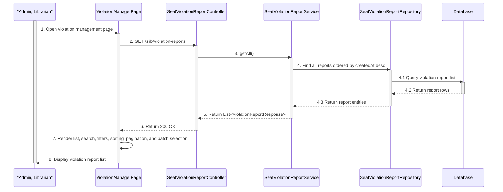

# FE-100 View List of Seat Violation Reports

```mermaid
sequenceDiagram
    participant Staff as "Admin, Librarian"
    participant ViolationManage as ViolationManage Page
    participant ViolationController as SeatViolationReportController
    participant ViolationService as SeatViolationReportService
    participant ReportRepo as SeatViolationReportRepository
    participant DB as Database

    activate Staff
    Staff->>ViolationManage: 1. Open violation management page
    activate ViolationManage
    ViolationManage->>ViolationController: 2. GET /slib/violation-reports
    activate ViolationController
    ViolationController->>ViolationService: 3. getAll()
    activate ViolationService
    ViolationService->>ReportRepo: 4. Find all reports ordered by createdAt desc
    activate ReportRepo
    ReportRepo->>DB: 4.1 Query violation report list
    activate DB
    DB-->>ReportRepo: 4.2 Return report rows
    deactivate DB
    ReportRepo-->>ViolationService: 4.3 Return report entities
    deactivate ReportRepo
    ViolationService-->>ViolationController: 5. Return List<ViolationReportResponse>
    deactivate ViolationService
    ViolationController-->>ViolationManage: 6. Return 200 OK
    deactivate ViolationController
    ViolationManage->>ViolationManage: 7. Render list, search, filters, sorting, pagination, and batch selection
    ViolationManage-->>Staff: 8. Display violation report list
    deactivate ViolationManage
    deactivate Staff
```

