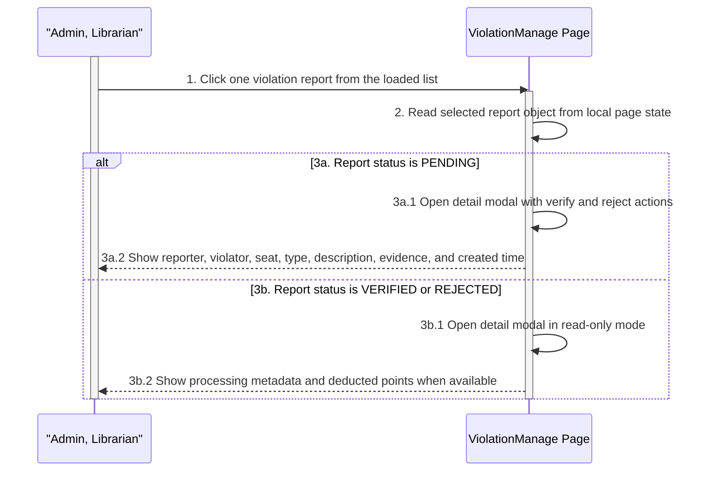

# FE-97 View Report Seat Violation Details

```mermaid
sequenceDiagram
    participant Staff as "Admin, Librarian"
    participant ViolationManage as ViolationManage Page

    activate Staff
    Staff->>ViolationManage: 1. Click one violation report from the loaded list
    activate ViolationManage
    ViolationManage->>ViolationManage: 2. Read selected report object from local page state

    alt 3a. Report status is PENDING
        ViolationManage->>ViolationManage: 3a.1 Open detail modal with verify and reject actions
        ViolationManage-->>Staff: 3a.2 Show reporter, violator, seat, type, description, evidence, and created time
    else 3b. Report status is VERIFIED or REJECTED
        ViolationManage->>ViolationManage: 3b.1 Open detail modal in read-only mode
        ViolationManage-->>Staff: 3b.2 Show processing metadata and deducted points when available
    end

    deactivate ViolationManage
    deactivate Staff
```
